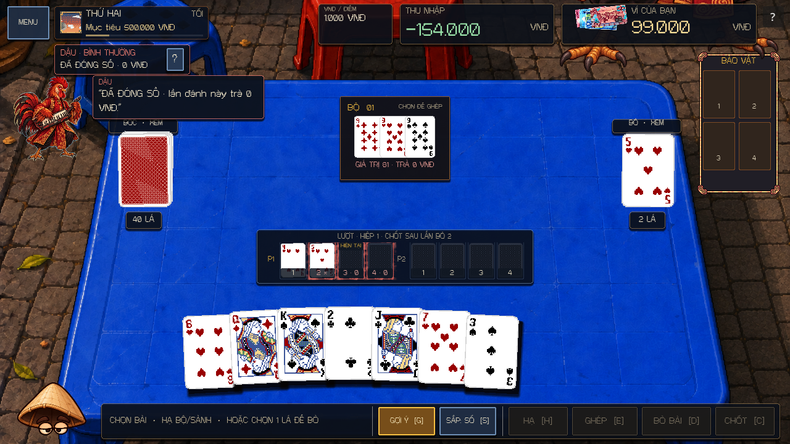
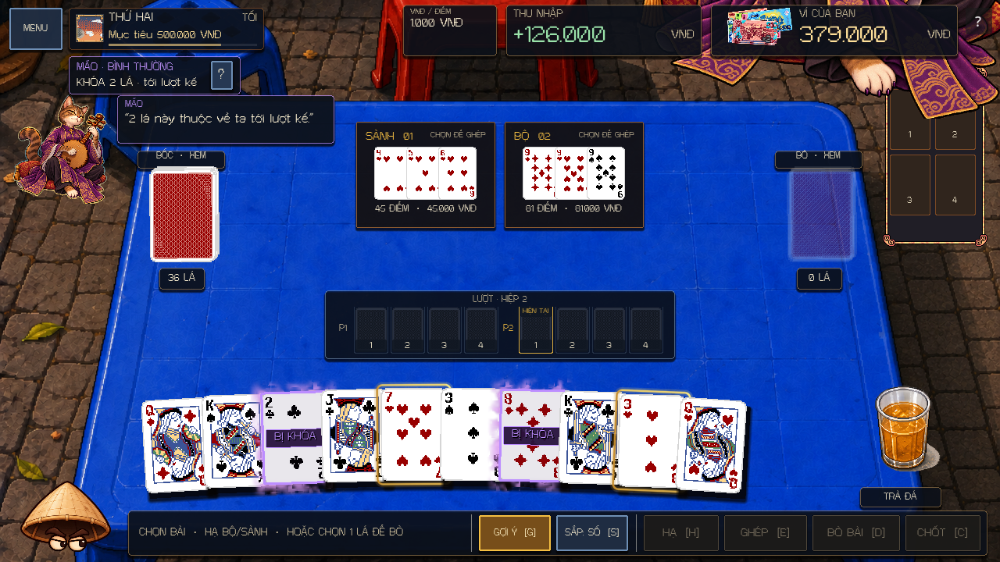

# Rooster and Cat table presentation — 3 October 2026

The Evening Deal now keeps the boss on the table, with a compact status beside the day/objective HUD. The former central boss card is replaced by a 220 × 48 badge. Its `?` button opens the complete authoritative rule in a side drawer; Escape closes it. Speech clears while reading rules or opening menus and phase modals.

- The turn register is wider and lower. Both phases have persistent numbered card backs, a current-turn text marker, and committed discard faces in the same slots. Rooster's actual difficulty deadline marks the closing discard with `×` and a red shader; later Phase 1 turns show `0`. Existing Meld displays distinguish intrinsic value from their suppressed zero payout. Phase 2 retains ordinary scoring. Mandatory discard targets still retain physical card IDs and Drink targeting.
- Cat's locked cards retain their label and outline, with animated purple smoke on a separate padded surface. Printing, Gieo Quẻ treatments, selection and legal-action outlines remain separate. Smoke follows the current lock set after each refill. Clicking or dragging a locked card gets a short reaction; a forbidden drag never creates a card payload.
- The supplied evening overlay art remains in its native framing. A small floating portrait accompanies arrival, register closure, zero payouts, lock changes and paid player actions. The speech queue is bounded and gives current rule changes priority.
- Day, period, objective and a thin progress bar share one header panel. Backgrounds on the day and money HUDs, Melds, action dock, buttons, pile captions, Drink nameplate, turn register and notices are translucent; text and interaction cues retain their contrast.
- Melds have a reserved area above the register. Table notices occupy the left margin, and zero-payout explanations use boss speech. Daytime promises use the same compact location with complete terms available through `?`.

Presentation reads `ZodiacBossRule`, committed action results and the wallet. This pass does not alter boss tuning, payouts, deck contents, save format or deterministic boss RNG. Existing unrelated work in progress was preserved; no staging, commit or push was performed.

Source entry points are `scripts/ui/zodiac_boss_hud.gd`, `scripts/ui/table_hud_presentation.gd`, `scripts/ui/zodiac_card_fx.gd`, `shaders/zodiac_card_aura.gdshader`, the turn-register integration in `scripts/ui/match_ui.gd`, the payout display in `scripts/ui/meld_view.gd`, and the Cat layer in `scripts/ui/playing_card_view.gd`.

Validation used fresh Godot 4.7.1 processes and isolated app-data profiles. Core passed 335/335; the full repository validator passed. Following layout and interaction refinements, runtime, tutorial, the 746-check full Zodiac roster, the 106-check Zodiac scene and the 332-check Cat persuasion scene passed. Core, runtime, tutorial and the roster were rerun after the final payout-display change. The final focused boss smoke passed 607 checks headlessly and 607 with the native Forward+ D3D12 renderer. Compatibility OpenGL also passed its earlier rendered version. Captures cover English and Vietnamese at 1280 × 720, 1920 × 1080, 2548 × 1368 and 960 × 620.

The focused smoke commits real mandatory discards, tests all three Rooster deadlines and legal zero-payout Melds including their table labels, follows Cat locks across a real refill, commits paid Melds, checks physical-card accounting and RNG stability, and exercises the rule button and Escape through synthetic input. These checks and captures establish automated runtime, rendered layout and synthetic input evidence. They do not establish physical touchscreen, listening or exported-build validation.

