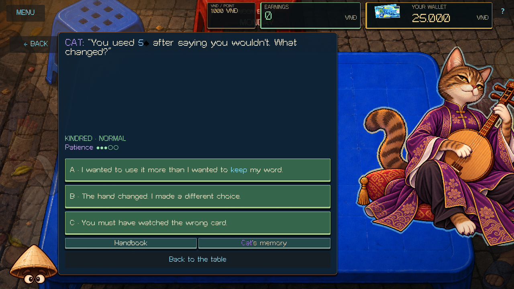
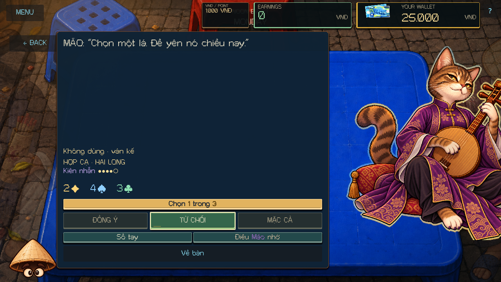
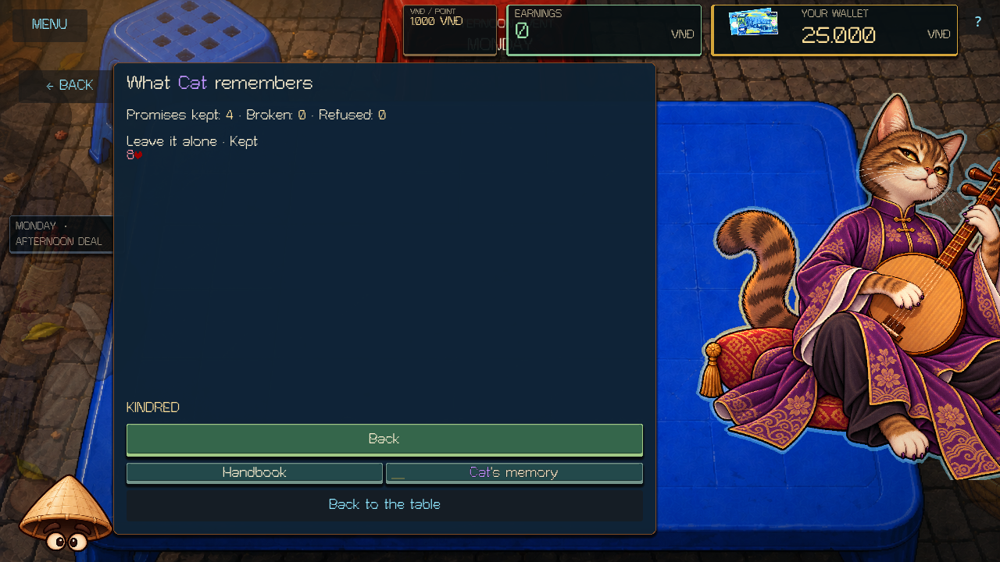
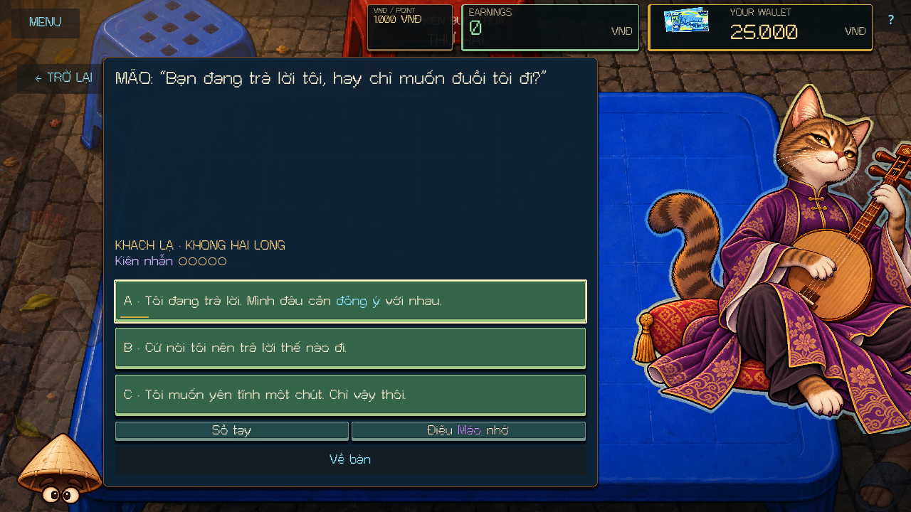

# Cat expansion — 10 October 2026

Cat's daytime system now continues from Familiar to Kindred. She recalls concrete promises across visits and New Run, asks different follow-up questions after a kept promise, a breach, or a refusal, and offers a commitment whose physical card the player chooses. This pass deepens the character and her existing connection to tonight's difficulty.

## Conversations and progression

The six original Tier 1 / Tier 1+ nodes and the supplied dialogue source remain intact. Six new Tier 2 nodes are authored in `scripts/zodiac/content/cat_expansion.gd`:

| Node | Encounter |
| --- | --- |
| `cat.t2.boundaries` | Keeping something does not mean promising to keep it forever. Cat respects an honest boundary over empty agreement. |
| `cat.t2.sit_here` | Cat asks why the player still sits with her when they could play alone. |
| `cat.t2.your_choice` | The player chooses one of three real cards to leave untouched during the Afternoon Deal. |
| `cat.t2.card_memory` | Nine answer variants across kept, broken, and refused card-use commitments. The settled outcome selects the exchange. |
| `cat.t2.relic_memory` | Cat recalls the actual Relic retained, lost, or refused and asks about the player's decision. |
| `cat.t2.change_memory` | Cat recalls a card-preservation promise and asks what the player's words meant. |

The three memory nodes provide nine outcome-specific openings. They require an actual settled memory; they cannot claim an event that never occurred. Standalone encounters remain available when a new or older profile has no such memories. All new copy has English and Vietnamese variants.

Stranger → Familiar still requires a Pleased visit. Familiar → Kindred requires **three kept promises across at least two of the three existing promise kinds**, followed by a Normal or Pleased Afternoon judgement. Repeated Pleased answers or repetitions of only one promise kind cannot unlock Kindred. There is no permanent affection score and no relationship downgrade for an Unpleased day. Tier 2 begins on a subsequent visit; the current conversation remains saved as selected. Confidant and Companion still have no new progression rules in this pass.

The voluntary card promise shows its three candidates before commitment. Accept requires one selected physical identity; inspecting or selecting costs nothing. The offer does not reroll through Haggle. Accept saves only the chosen card, and the existing Afternoon observation and judgement window decides fulfillment. Refusal remains free and has Patience delta zero. Acceptance itself awards no fulfillment.

## Last Chance and presentation

At the first zero Patience, Cat asks whether the player is answering her or trying to get rid of her. Honest disagreement or asking for quiet recovers to one Patience; asking for the desired answer ends the visit. Recovery is available once per visit. A later zero locks the visit. Token checks prevent duplicate recovery, and saved Last Chance choices resume in a fresh process. Already-saved `last_chance_pending` encounters keep their existing explicit exit.

The conversation footer now includes **Cat's memory**. It shows kept, broken, and refused commitments, the latest outcome of each kind, the relevant physical card or Relic, and the requirements for Kindred while Familiar. Opening it and returning leave the current question, offer, choice, wallet, boss state, and RNG untouched. Refresh preserves the memory view.

Conversation lines retain shared typewriter behavior and input to finish a reveal. Terms, Patience, relationship labels, and the memory records appear immediately. The relationship announcement names the tier actually earned.

## State and authority

`ZodiacService` still owns the encounter and `ZodiacPersuasion` interprets authored content. `ZodiacProgress` stores concrete history and a bounded latest-memory entry for each promise kind. Each memory contains a result, semantic topic, source node, physical card ID and its label at acceptance or Relic ID, counteroffer provenance, event ID, and monotonic revision. Memory updates use the existing replay-deduplication ledger. Older checkpoint merges cannot replace a newer remembered result; replayed outcomes cannot increment history or relationship transitions twice.

The active node freezes its recalled outcome and bilingual lines when opened. Later permanent history changes or restoring an older conversation cannot rewrite the question already shown. Run snapshots and permanent meta profiles include optional `memories`; missing fields in old saves default to empty. The run envelope remains version 2. Existing pending promises lacking acceptance-time memory details still settle through their saved original terms.

`DealState`, card mutation services, Relic ownership, the wallet, and scoring retain their authorities. This pass observes their existing committed events. The evening Stalk rule and its 1 / 2 / 3 lock counts are unchanged. The source dialogue SHA-256 remains `84a401a39732edef2e1ee44a44bc48bad5d4643245c4eab6e69b08a65be7df1d`; `rules/cat.gd` remains `7bbbb7b056309e1e0ba4af9bab574a424d2fe5e63f19ddbd33fe7b56116342dd`.

## Verification

Final results and log/capture hashes are recorded in [the validation manifest](CAT_EXPANSION_VALIDATION_2026-10-10.json). All engine error scans are clean.

| Check | Result |
| --- | --- |
| Fresh editor import and main-script parse | Passed |
| Complete deterministic suite | 413 / 413 passed |
| Main-scene runtime | Passed |
| Existing Cat persuasion, rendered | 333 checks, 0 failures |
| Expanded Cat, rendered EN/VI at both sizes | 557 checks, 0 failures; 60 captures |
| Fresh-process Cat write / read | 14 + 44 checks, 0 failures |
| Zodiac scene, rendered | 106 checks, 0 failures |
| Boss presentation, rendered | 647 checks, 0 failures |
| Legacy negotiation write / read | 5 + 10 checks, 0 failures |
| Unrelated dirty baseline files | 0 changed |
| Scoped whitespace check | Passed |

The 413-test suite contains the new deterministic tests; its count is not added to scene-smoke assertions. The complete core run passed after the final runtime changes. The final focused nine-check run then passed after scene-test fixture corrections and editor import. The focused command is:

```powershell
./tools/validate_project.ps1 -Godot <Godot-console-path> -Only parse,core,runtime,cat-scene,cat-expansion,cat-write,cat-read,zodiac_scene,boss-presentation,negotiation-write,negotiation-read -RenderedChecks cat-scene,cat-expansion,zodiac_scene,boss-presentation
```

The expansion scene smoke uses the real MatchUI and synthetic pointer input, checks both languages at 1280×720 and 1920×1080, chooses a card through the shared DeckScreen, accepts and judges the actual promise, inspects memory without state mutation, and triggers Last Chance through three real negative answers. Deterministic coverage includes progression requirements, exact target recall, save replay, profile persistence, frozen conversation memory, old-save defaults, choice legality, and replay-resistant recovery.

The results above describe the working-tree implementation pass. Delivery validation against the isolated Cat/Rooster checkpoint is recorded in [the checkpoint report](CAT_ROOSTER_CHECKPOINT_2026-10-11.md). Existing unrelated work in progress is preserved.

## Rendered evidence

The outcome matrix seeds deterministic past memories to inspect every conversation branch. The final card-selection flow accepts and judges a new promise through the actual GUI; its memory is shown below.








