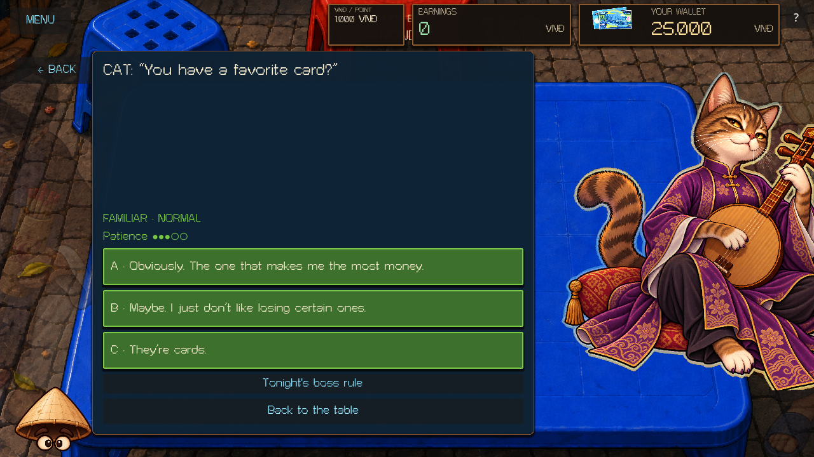
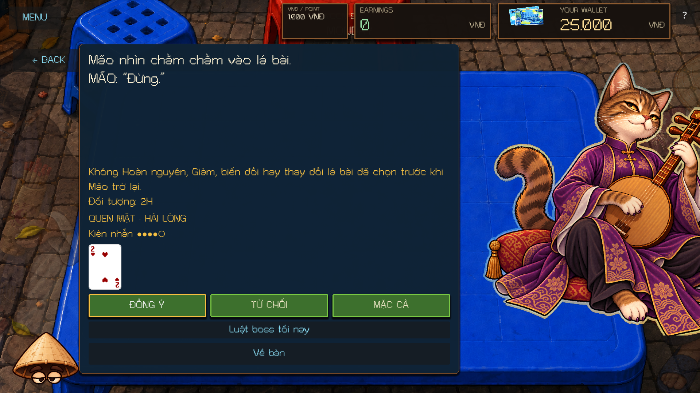
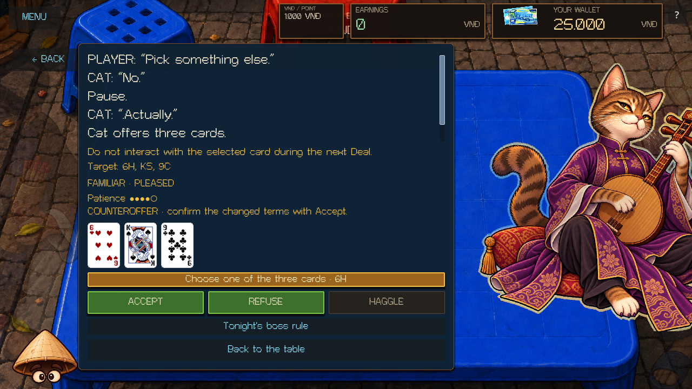
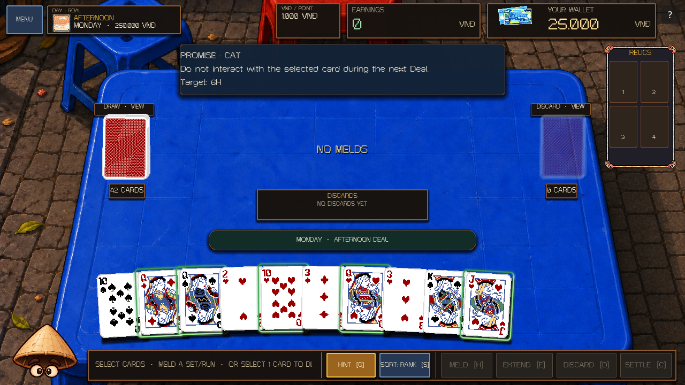
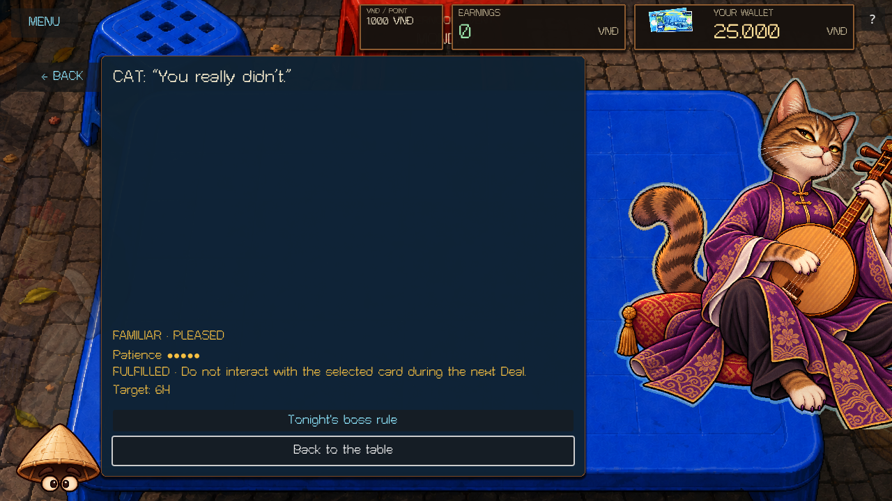

# Cat Tier 1 / Tier 1+ persuasion — 2026-10-03

Cat now uses the supplied authored Questions and Promises to produce daily Patience and the existing Evening boss disposition. A fresh player meets Cat as STRANGER, can finish the first visit PLEASED, and permanently unlocks FAMILIAR for future Tier 1+ visits. The upgrade survives New Run and checkpoint replay.

The implementation reuses the current Noon → Afternoon Deal → Afternoon Event → Evening structure. The user's clarification fixes both “before Cat returns” promises to the **same-day Afternoon return**.

## Authored content

[The supplied dialogue](authoring/CAT_TIER_1_AUTHORITY.txt) is retained byte for byte. Its SHA-256 is `84a401a39732edef2e1ee44a44bc48bad5d4643245c4eab6e69b08a65be7df1d`. The bilingual runtime transcription is [cat_tier_1.gd](../scripts/zodiac/content/cat_tier_1.gd). English spoken lines, answer order, Patience deltas, stage directions, promise wording, and response/outcome exchanges remain authored content. Vietnamese is localized at the existing `ZodiacCatalog.words()` boundary.

| Semantic node ID | Content | Ordered answer deltas A / B / C | Gameplay |
| --- | --- | --- | --- |
| `cat.t1.favorite_card` | Favorite card | 0 / +1 / −1 | Question |
| `cat.t1.keeping_things` | Keeping things | +1 / 0 / −1 | Question |
| `cat.t1.curiosity` | Curiosity | +1 / 0 / −1 | Question |
| `cat.t1plus.leave_it_alone` | Then leave it alone | 0 / +1 / −1 | Leave a selected physical card untouched during the Afternoon Deal |
| `cat.t1plus.keep_it` | Keep it | −1 / 0 / +1 | Retain an owned Relic until the Afternoon return |
| `cat.t1plus.dont_change_it` | Don't change it | 0 / +1 / −1 | Preserve a changed card until the Afternoon return |

All three Promise refusals apply the authored delta 0. Accept stores pending terms; it does not pay money, transfer a Relic, mutate a card, or award fulfillment immediately. Fulfillment applies +1; breach applies −1 with the supplied Cat reaction.

Haggle reveals replacement terms and requires a separate Accept:

- Leave it alone: Cat offers exactly three valid physical cards; the player chooses one through the shared inspect/sort/search DeckScreen. The accepted target alone appears in the reminder and result.
- Keep it: Cat selects another owned Relic from a small valid set.
- Don't change it: Cat selects another valid changed card.

An unavailable alternative disables Haggle with an explanation. A missing Relic or changed-card requirement excludes that node; the engine selects another valid authored encounter. Changed cards include rank, suit, Gieo properties, and other permanent changes recognized by `CardData.has_permanent_changes()`.

## Runtime and ownership

`ZodiacPersuasion` is one data interpreter owned by `ZodiacService`. It keeps all durable encounter values inside `ZodiacService.daily.persuasion`; it is neither a second campaign authority nor a second gameplay simulator. No answer contains runtime personality traits. Topics organize authoring only.

| Owner | Responsibility |
| --- | --- |
| `ZodiacCatalog` / `content/cat_tier_1.gd` | Authored nodes, requirements/history, optional once-only and linked follow-up nodes, visit limits, Last Chance and Special configuration, bilingual text |
| `ZodiacService` / `ZodiacPersuasion` | Saved conversation selection, answers, pending terms, Patience, authoritative observations, once-only Afternoon judgement, boss disposition |
| `ZodiacProgress` / existing meta save files | Permanent relationship tier, first meeting, ever-pleased flag, content flags and progression deduplication |
| `CardTargetQuery` | Valid physical-card pools and seeded selection; new permanent-change query leaves existing targeting semantics intact |
| `DealState` | Legal committed card interactions and their physical IDs; existing scoring and payout rules |
| `CardData`, Gieo service, `RelicRuntime`, `VndWallet` | Persistent card mutations, completed transformations, inventory ownership and journaled money |
| `RunSave` | Existing atomic run save, encounter snapshot, observer suppression/rebinding during restoration |
| `ZodiacTable`, shared DeckScreen, `ZodiacBossHUD` | Read-only presentation and player intentions |

STRANGER receives the three surface Questions in a saved shuffled order. FAMILIAR receives one eligible deeper encounter per Noon. These counts are content configuration. Selection avoids the immediately previous node when alternatives exist. Only the existing dedicated Zodiac negotiation RNG advances; deck, Gieo, boss and unrelated service streams remain isolated.

Patience starts at 3, clamps to 0–5, and maps 4–5 to PLEASED, 2–3 to NORMAL, and 0–1 to UNPLEASED. Five dots and the named disposition expose mood separately from the permanent relationship label. The canonical five relationship tiers exist in the data model; only STRANGER → FAMILIAR has a progression rule.

The first zero consumes the encounter's Last Chance and suspends normal choices. Authored recovery can restore Patience to 1 or lock the visit on failure; a later zero locks immediately. Cat has no authored recovery data. The current UI explicitly identifies that pending authoring state and lets the player end today's visit without fabricated Cat dialogue.

Special eligibility is checked before normal selection. Cat's Special list is empty. Its former invented Special scene and new Emblem award path are disabled; already-owned Emblems remain saved.

## Observation windows

- Card use starts with the Afternoon Deal and ends with its completion. Committed Melds, newly added Extension cards, discards, Drink targets, recovery/return, preservation and DUMP interactions supply physical IDs. Draw/refill, inspection, invalid actions, and scoring an old Meld again do not breach a promise.
- Relic retention starts at Accept and ends at Afternoon judgement. Unequipping is safe; ownership removal breaches permanently even if the same Relic is reacquired.
- Card preservation starts at Accept and ends at Afternoon judgement. Real `CardData` mutation signals and Gieo completion observations catch changes, including mutation followed by reversal. Saved fingerprints provide an additional judgement check.

Observation records and broken flags are monotonic. Relevant pending outcomes are settled after the Afternoon Deal completes. The service marks each outcome applied before updating permanent history, clears it from pending promises, and retains the exact terms and reaction in the encounter's outcomes. Repeat entry or reload cannot apply the social delta or relationship award twice.

THE STALK was not edited. `scripts/zodiac/rules/cat.gd` still matches the captured pre-task file byte for byte, SHA-256 `7bbbb7b056309e1e0ba4af9bab574a424d2fe5e63f19ddbd33fe7b56116342dd`. The existing boss configuration receives the final disposition; lock counts remain 1 / 2 / 3 for PLEASED / NORMAL / UNPLEASED. No scoring, audio-design, opponent-AI or boss-mechanic changes were added.

## Replaced behavior and save compatibility

Fresh Cat encounters no longer generate the previous 2–3 cost demands, personality favorites, success-count disposition, or placeholder Special progression. Rooster's existing demand grammar remains available. An already-started older Cat negotiation finishes under its saved original terms for that day; the next day uses the authored persuasion engine. Existing scheduled skips and legacy promises retain their compatibility path.

The run envelope stays at version 2; its nested Zodiac snapshot advances to version 3. Optional/default fields preserve old save loading. Legacy NEUTRAL final negotiation values normalize to NORMAL, and the existing difficulty adapter still accepts legacy aliases.

New permanent record values are `relationship_tier`, `first_meeting`, `ever_pleased`, `pleased_outcomes`, `familiar_transitions`, authored `content:<node-id>` flags, and seen judgement/transition IDs. Existing profile merges retain their monotonic max/OR behavior.

New encounter values include:

- `persuasion.version`, `patience`, `relationship_at_start`, `status`, `stage`, `plan`, `cursor`, `revision`, `node`, `dialogue`, `next_stage`, optional `next_node_id`, `history`, `outcomes`, and `committed`.
- Original `terms`, visible `counteroffer`, and player `selection`, all referencing physical `unique_id` strings.
- `last_chance_consumed`, `interaction_locked`, optional recovery/suspended state, `final_disposition`, and `judged`.
- `conversation_history` and the existing saved negotiation RNG state.

Tracked promises explicitly store stable/semantic IDs, node/Zodiac, immutable `accepted_terms`, physical targets or Relic ID, accepted day, window, deal phase, judgement slot, started/completed/broken/status flags, deduplicated observations, outcome-applied flag, authored outcome data and card baseline. `CardData.mutation_revision` is persisted by the existing whitelisted value serializer.

Restoration suppresses live observers while authorities are reconstructed, then rebinds them to restored physical cards and services. A restored question, reaction, counteroffer, selection, breached promise or judged result resumes without rerolling or restarting its conversation.

## Files changed for this pass

The checkout already contained substantial unrelated WIP. The following list identifies this task's edits; it is not a claim that every current Git change belongs to this task.

Added:

- `scripts/zodiac/content/cat_tier_1.gd`, `scripts/zodiac/zodiac_persuasion.gd`, and generated UID sidecars.
- `docs/authoring/CAT_TIER_1_AUTHORITY.txt`, this report, its validation JSON and selected rendered evidence under `docs/images/cat_persuasion/`.
- `tests/test_cat_persuasion.gd`, `tests/zodiac_test_flow.gd`, `tests/cat_persuasion_scene_smoke.gd`, `tests/cat_persuasion_resume_smoke.gd`, and UID sidecars.

Extended existing files, including files already in the WIP:

- `scripts/zodiac/{zodiac_catalog,zodiac_service,zodiac_progress}.gd`.
- `scripts/cards/{card_data,card_target_query}.gd`, `scripts/gameplay/deal_state.gd`, `scripts/relics/relic_catalog.gd`.
- `scripts/campaign/{run_save,campaign_manager}.gd`.
- `scripts/ui/{zodiac_table,zodiac_boss_hud,match_ui}.gd`.
- `tests/{test_zodiac,test_campaign,test_gieo_que,test_misc_npc,campaign_overhaul_scene_smoke,zodiac_scene_smoke,zodiac_negotiation_resume_smoke,run_headless,zodiac_negotiation_tests}.gd`.
- `tools/validate_zodiac_negotiation.ps1`, `README.md`, `docs/ZODIAC_VERTICAL_SLICE.md`, and `docs/ZODIAC_NEGOTIATION_2026-10-02.md`.

Older generic cost/selection fixtures now use Rooster; a shared test-only flow helper completes authored Questions without pretending they are Refuse demands. No wallet/event-table smoke implementation was changed for this task. No Git commit, push, export or publication was performed.

## Validation

The final fresh-process full run passed all 15 checks. Exact markers and log hashes are recorded in [the validation JSON](CAT_PERSUASION_VALIDATION_2026-10-03.json). All final stderr logs were empty; no SCRIPT ERROR / ERROR / Parse Error was reported.

| Suite | Final result |
| --- | --- |
| Complete deterministic regression suite | 335 / 335 passed; 0 failed, 0 skipped |
| Focused Zodiac / Gieo / Cat suite | 73 / 73 passed |
| Rendered Zodiac scene | 106 checks, 0 failures |
| Rendered Cat persuasion scene | 332 checks, 0 failures; 29 captures |
| Fresh-process Cat write / read | 11 + 32 checks, 0 failures |
| Fresh-process legacy negotiation write / read | 5 + 10 checks, 0 failures |
| Rendered Event Table | 116 checks, 0 failures |
| Rendered Gieo screen | 474 checks, 0 failures |
| Rendered all-boss roster | 746 checks, 0 failures |
| Rendered runtime / tutorial / campaign / miscellaneous NPC scenes | All passed |
| Working-tree whitespace check | `git diff --check` passed |

The pre-task deterministic baseline was 308 / 308. The 27 new Cat tests are included in the 335-test total and in the focused suite; those suite counts must not be added together.

The 27 new deterministic Cat tests cover authored text/deltas, Patience clamps/maps, Last Chance and replay, permanent meta profiles/New Run, eligibility including property-only transformations, all three Haggles, committed real card/Drink/Gieo/Relic interactions, exact restore states, window boundaries, RNG isolation, Evening handoff and legacy saves. The rendered Cat smoke drives the real MatchUI and shared DeckScreen with synthetic mouse/keyboard events, checks modal isolation, and captures all six nodes in English/Vietnamese at 1280×720 and 1920×1080. Separate write/read processes check true fresh-process resume.

Commands used with Godot 4.7.1:

```powershell
# Fresh editor scan and parse checks used isolated APPDATA / LOCALAPPDATA.
& $Godot --headless --path G:\PHOM\TRADATALA --audio-driver Dummy --rendering-method gl_compatibility --editor --quit
& $Godot --headless --path G:\PHOM\TRADATALA --audio-driver Dummy --rendering-method gl_compatibility --check-only --script res://scripts/ui/match_ui.gd

# Includes deterministic, rendered, and separate-process resume checks.
& .\tools\validate_zodiac_negotiation.ps1 -Rendered -Full
git diff --check
```

The runner creates isolated profiles, checks exit codes, rejects SCRIPT ERROR / ERROR / Parse Error, and requires an explicit successful completion marker. An earlier broad rendered attempt stopped in the unchanged Event Table smoke on a freed wallet-inspection view at line 175; a fresh full rerun passed its 116 checks without a wallet change. That intermittent smoke failure is recorded rather than counted as a pass.

Screenshot inspection found and repaired two issues beyond visibility checks: the reminder's pre-layout autowrap could grow into a blank screen-height panel, and a judged three-card counteroffer still named every offered card. The final reminder is compact and results name only the accepted physical target.

## Review images











## Deliberate authoring gaps and evidence limits

Cat Last Chance recovery, Cat Special / Đông Hồ / ending scenes, Tier 2 or later content, and higher relationship progression rules remain absent. No speculative immediate gameplay verbs or other Zodiac dialogue were authored.

Rendered evidence uses automated synthetic mouse/keyboard input on actual Godot scenes. It does not establish physical touchscreen testing, manual playthrough completion, audio listening, export-package validation or extended balance quality.
