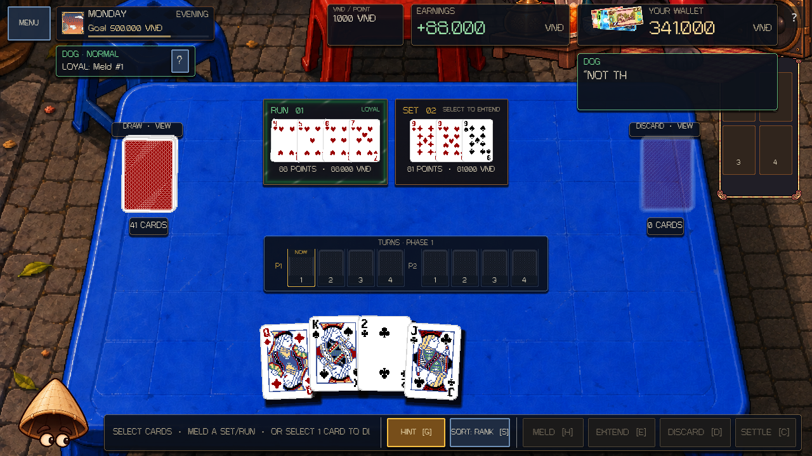
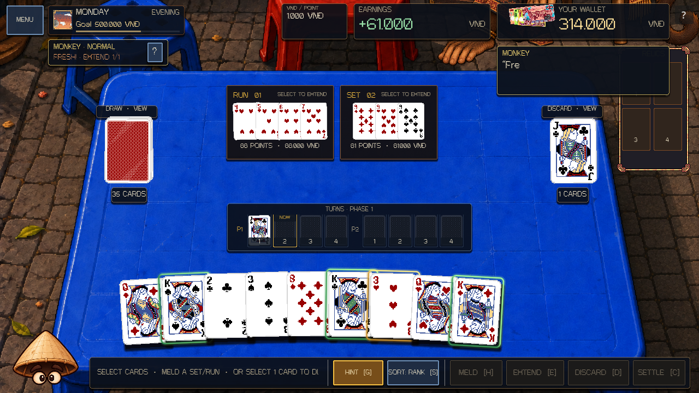
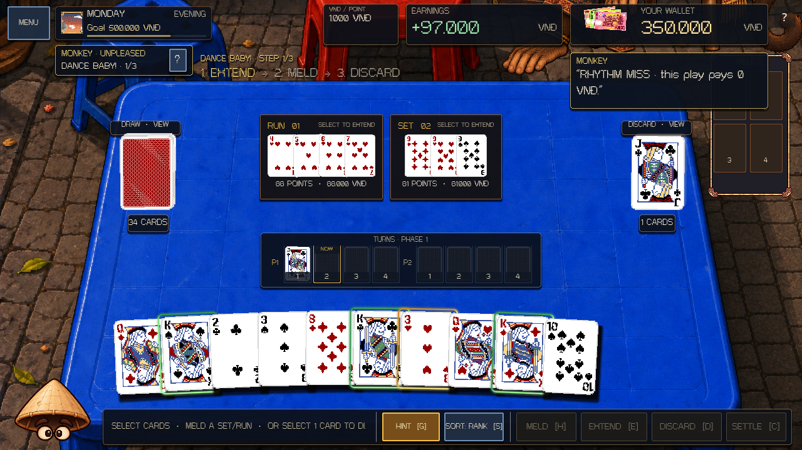
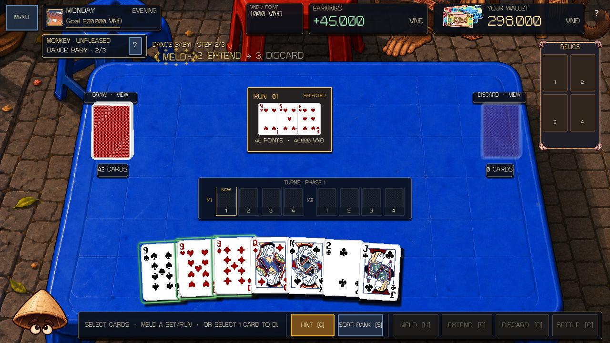

# Dog and Monkey table presentation — 4 October 2026

The second Zodiac pairing uses the existing Rooster/Cat boss badge, supplied Evening overlay, speech and rule drawer. Each effect follows the physical object or action affected by that boss.

- **Dog:** the authoritative loyal Meld has a green protective perimeter shader with moving sparks, a green title and a localized loyalty hint. Other Melds receive no guard. Extensions retain the guard; phase reset and boss changes remove it. Legal Extension, selection and Drink hints take priority over the loyalty caption. Card faces and their Gieo treatments retain their own materials.
- **Monkey / Fresh:** the top-left boss badge shows `FRESH!`, the last paid action and the current count/cap. The cap comes from the current severity. Its glyph shader warms when the chain is full; the tooltip and boss speech explain switching between Meld and Extend. Unpaid repeats and discards do not invent a counter reset.
- **Monkey / Dance Baby:** every action in the real three-action sequence appears as floating text above the Meld area. The current step uses gold animated glyphs; completed and upcoming steps remain visible. Correct paid scoring actions and a required discard advance the marker. The completed text pops/slides with a check mark and a local spark shader, then fades. Misses do not advance or celebrate. There is no frame, background or input surface.

The Meld area reserves a text lane only during Dance Baby. The full sequence fits in English and Vietnamese; font sizing preserves every action instead of ellipsizing the required move. Menus, modals and rule inspection clear the floating guide. The money receipt occupies the same region, so the guide hides and its completion tween pauses during scoring; the celebration resumes when the table returns. Normal Meld geometry returns when Dance Baby is no longer active.

Rooster retains the red register deadline effect; Cat retains purple smoke on locked physical cards. Dog's green guard and Monkey's text effects use separate shader resources. No generic shader is applied across the roster or to the boss artwork.

## Ownership and source

`ZodiacBossRule` and the existing Dog/Monkey mechanics continue to own loyalty, repetition, sequence advancement, payouts, phase resets, RNG and save state. Presentation consumes those committed values. This change adds no gameplay counter or sequence authority, changes no tuning or save format, and preserves the pre-existing UI/text-reveal work.

- `scripts/ui/meld_view.gd` and the existing `_sync_melds()` path in `scripts/ui/match_ui.gd`: loyal Meld projection.
- `scripts/ui/zodiac_boss_hud.gd`: pair accents, Fresh status, guide geometry and boss reactions.
- `scripts/ui/monkey_dance_guide.gd`: text sequence, completion effects and receipt pause/resume.
- `shaders/dog_loyal_meld.gdshader`, `monkey_rhythm_text.gdshader`, `monkey_step_burst.gdshader`: mechanic-specific effects.
- `tests/dog_monkey_presentation_smoke.gd`: committed actions, misses, Extensions, discard, severity, restore/reset, pointer input, receipt interaction and responsive layout. The standard project validator now includes this smoke.

## Verification

Final focused smoke: **709 checks, zero failures**, both headless and native Vulkan/Forward+ on Godot 4.7.1. Rendered captures cover English and Vietnamese at 1280×720, 960×620, 1920×1080 and 2548×1368. Screens were inspected for loyalty scope, counter fit, sequence readability and completion effects after the real pointer-driven money receipt.

Supporting regressions passed during this change: core **335/335**, main-scene runtime smoke, Rooster/Cat presentation **631 checks**, real boss money presence **29 checks**, and full Zodiac roster **746 checks**. Editor import and whitespace checks passed. Final focused runs and the regression runner use isolated app-data profiles; logs and additional captures are under `.godot/dog-monkey-presentation/`.

These are source/runtime/rendered checks with synthetic pointer input. No exported-build or physical touchscreen validation was performed. Changes remain local and uncommitted; no checkpoint or push was requested.

