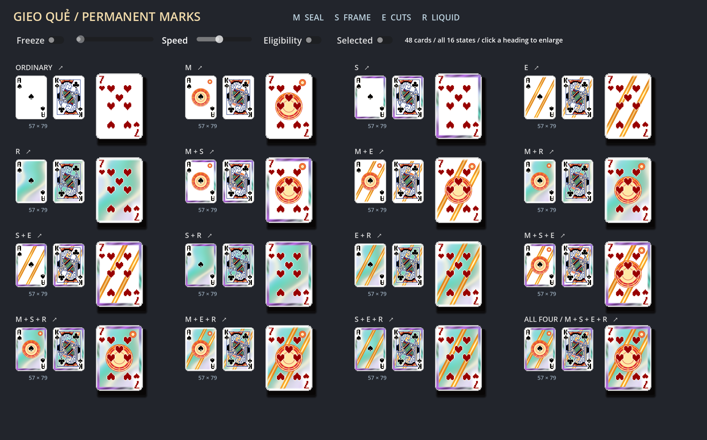
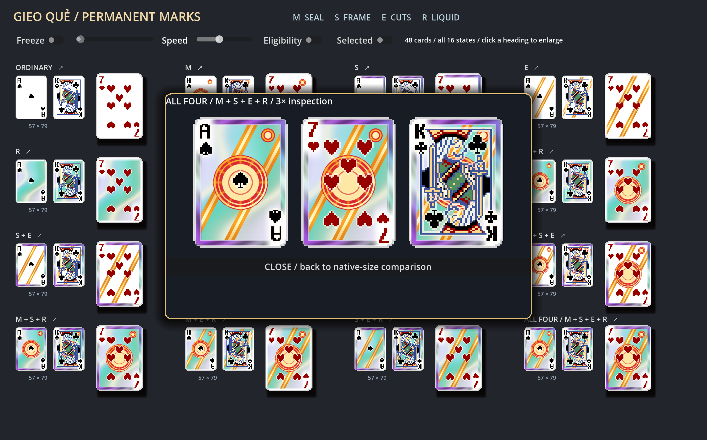

# Gieo Quẻ: permanent card marks

Visual redesign, 2026-09-10. Four persistent property signatures share one printing
system. The pale embossed/silk study is replaced; the score-trigger VFX system
remains removed. No shader or artwork from another game is used.

## Four identities

| Property | Signature | Motion |
| --- | --- | --- |
| MAKING_PHOM_RETRIGGER | Vermilion seal: gilded double rings and radial engraving at the center; a matching small hallmark at upper-right survives busy court art | Reflection travels around the engraved metal |
| SET_RETRIGGER | Spectral frame: a faceted jade/amethyst border inside the physical card | Facets catch a travelling perimeter reflection |
| EXTEND_RETRIGGER | Gilded cuts: two permanent diagonal incisions through the paper | Specular light travels along the cuts |
| RUN_RETRIGGER | Liquid foil: broad cyan/amethyst iridescence across the paper | Curved reflection cells and bright caustic bands flow continuously |

The geometry distinguishes the properties even when their colors overlap. Making
is a seal, Set is a frame, Extend is diagonal, Run is a moving surface. The palette
supports that distinction rather than doing all the work. The seal is engraved
printing, not a radial glow; its geometry stays fixed as its metal catches light.

## Composition

Every combination follows the same print order:

1. Run supplies the liquid ground.
2. Extend cuts two gilded diagonals through it.
3. Making stamps a central seal over the ground/cuts.
4. Set frames the composition inside the card perimeter.
5. Making's small matching hallmark remains visible on busy face-card art.

Each mask replaces its own region. There is no sum of four full-card effects and
no combination-specific opacity reduction. Set + Extend retains both its frame
and its two cuts. Making + Set + Extend adds the central seal without eliminating
the exposed portions of the cuts. All Four is the full framed, sealed, gilded foil
composition; it gains no extra gameplay property. Every ingredient remains visible.

The first draft's luminous center looked like an orb; it was replaced by sharply
engraved rings and spokes. The liquid ground was strengthened after native-size
comparison. A narrow light keyline around printed strokes preserves contrast where
red/black ink crosses saturated material.

## Architecture and coverage

`shaders/gieo_card.gdshader` draws directly on the original TextureRect.
`scripts/ui/gieo_card_fx.gd` maps the existing properties to a Vector4, creates one
material per modified face, and reuses it. Normal faces retain/restore their original
material. The shader is shared; per-face uniforms are independent.

There are no additional production draw nodes, expanded quads, particles, render
viewports, trigger hooks, per-card update loops or per-frame material allocations.
Animation uses shader TIME. Artwork UVs are not displaced, original alpha is
preserved, and printed ink is excluded from recoloring. Both rank/suit corners
reserve white paper. Existing modulation/fades are preserved.

The existing integration covers hand faces, meld faces, discard top/history/archive,
card drag/flying/exhaustion copies, and Gieo snapshot/picker artwork. Eligibility
outlines and selection/hover behavior remain separate. This pass does not change
those interactions, scoring, card IDs, mutation, persistence or campaign rules.

## Assets and parameters

The current shader is entirely procedural and samples only the original card art
(five texture reads including the ink keyline). The generated noise and three masks
are no longer shader dependencies; their files remain available in `assets/vfx/gieo/`
for reference. No source images were cropped, changed or regenerated.

| Uniform | Default / purpose |
| --- | --- |
| strengths | Making, Set, Extend, Run membership |
| material_amount | 1.0; overall paper treatment |
| motion_speed | 0.65; shared automatic clock speed |
| seal_radius | 0.29; central seal extent |
| frame_width | 0.085; interior spectral frame width |
| cut_width | 0.055; gilded incision width |
| liquid_contrast | 1.0; liquid foil strength |
| vermilion / gold / jade / amethyst | Four material palette anchors |
| freeze_motion / sample_time | Development freeze and scrub controls |

## Comparison scene

Run `scenes/debug/gieo_card_fx_preview.tscn` with F6. All 16 states are visible at
once: ordinary, four singles, all six pairs, all four triples, and All Four. Each
state shows an Ace and busy King at 57x79 plus the production 86x119 hand control
with red number-card art: 48 cards total. Click any heading for a 3x inspection.

Freeze and its time slider stay synchronized. Scrubbing is enabled only when
frozen. Speed, eligibility-outline and selected-hand controls remain available.
Automatic animation is the startup/default state; no gameplay event is required.





## Validation

- Focused suite: 90/90 passed, no failures/skips. Core deal, campaign, Gieo mechanics,
  material reuse/reset/isolation, existing hand/table controls, snapshots/pickers,
  and empty-outline-palette guard are covered.
- Runtime scene smoke: `TRADATALA_SCENE_SMOKE passed`, exit 0. Shutdown also reported
  6 ObjectDB instances and 3 resources still in use; this run is not described as
  free of shutdown diagnostics.
- Live GPU check: 48 native-size samples; zero alpha, ink and normal-card violations
  over 38,848 ink samples. All 15 modified variants changed automatically over two
  seconds without uniform writes; zero variants changed while frozen.
- All 96 ingredient-removal comparisons produced visible changes: every ingredient
  contributes within every combination on each of the three tested card artworks.
  This is a guard against disappearing ingredients, not a claim that pixel counts
  alone prove aesthetic quality.
- Native matrix and 3x Set+Extend, Making+Set+Extend, and All Four inspected live.
- ScoringContext, ScoringPipeline, CardData and GieoQueService have no diff against
  the repository baseline. Scoped whitespace checks passed.
- Headless editor initialization completed, but reported an unresolved existing
  audio-bus UID (`uid://d12cwqh5xc7vn`) and an empty resource-save path. The live
  preview launched successfully. Audio/settings WIP was preserved.

Commands:

```text
Godot_v4.7.1-stable_win64_console.exe --headless --path . --script res://tests/gieo_fx_smoke.gd
Godot_v4.7.1-stable_win64_console.exe --headless --path . --script res://tests/runtime_scene_smoke.gd
```

Live GPU check from the preview:

```gdscript
await load("res://tools/gieo_material_render_check.gd").new().run(get_tree().current_scene)
```

## Files in this redesign

- `shaders/gieo_card.gdshader`: new procedural treatment and compositing.
- `scripts/ui/gieo_card_fx.gd`: removed unused noise dependency; retained adapter.
- `scripts/debug/gieo_card_fx_preview.gd`: all 16 combinations and enlarged inspector.
- `tools/gieo_material_render_check.gd`: all subsets, full-color animation detection,
  ingredient-removal checks and automatic/frozen playback checks.
- `README.md`, this document, and its comparison screenshots: current design/results.
