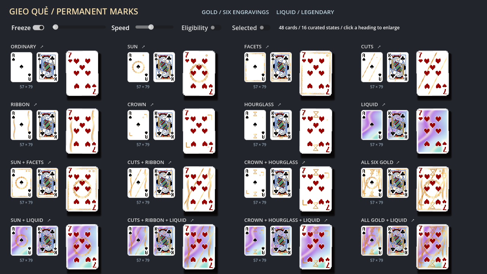
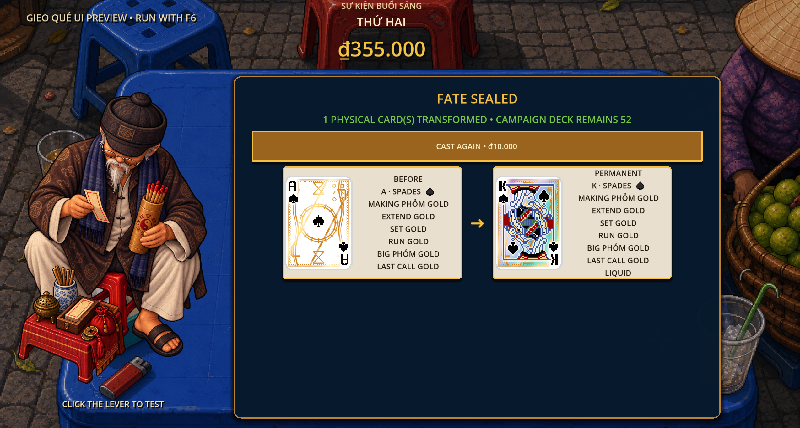

# Gieo Quẻ property overhaul — 2026-09-17

Status: IMPLEMENTED NOW in the working tree. This document supersedes older four-property Gieo mechanics and material descriptions. No commit, push, export, or packaging was performed.

## Scoring authority

Six conditional Gold properties share `ScoringContext.qualifying_gold()`. Each qualifying property adds the physical card's current `score_value()` once to `card_value_sum`, before the actual card-count multiplier and existing scoring modifiers. Gold does not add cards, passes, or recursive triggers. Multiple distinct Gold properties coexist and add independently; reacquiring the same property remains idempotent.

- `GOLD_MAKING_PHOM`: a card in a newly created meld.
- `GOLD_EXTEND`: only a newly committed extension card.
- `GOLD_SET` / `GOLD_RUN`: matching composition in the resulting scoring meld.
- `GOLD_BIG_PHOM`: at least four physical cards in the resulting meld.
- `GOLD_LAST_CALL`: newly committed by creation or extension while DealState is in `STATE_FINAL_COMMIT_WINDOW`, in either phase. Existing table cards and exhaustion events do not gain this condition. Preview/advisor paths receive the same explicit event flag.

`MELD_RETRIGGER` counts every Liquid card in the resulting meld exactly once per event. Each adds one complete Gold-enhanced scoring pass, with no cap and no recursive pass generation. Existing Liquid table cards remain active on extensions and exhaustion. Passes carry their individual source-card identity for feedback. Gold bonuses and their receipt hits use the same shared evaluator.

### Native scoring preserved

The existing SET 4/8/12/... and perfected RUN 13-card rules remain independent of Liquid. For extensions the sequence is: intrinsic delta, one native full-meld pass when applicable, then one full-meld pass per Liquid card. The existing old-score baseline remains `ScoringPipeline.meld_value(old_cards)`; it is not replaced by historic payout or accumulated echo totals. Gold enters the new event's full value before this baseline is subtracted.

Thus, absent a native milestone, total passes are 1 + Liquid count; at a native milestone there is the existing additional native pass. The native rule also remains in new-meld/exhaustion scoring as before. This reconciles the overhaul with the request to preserve ongoing native milestone work; no native mechanics were redefined.

## Casts and persistence

| First trigram | Ordinary outcome |
|---|---|
| DDD | SET Gold |
| DDA | Choose Rank |
| DAD | MAKING PHỎM Gold |
| DAA | BIG PHỎM Gold |
| ADD | LAST CALL Gold |
| ADA | EXTEND Gold |
| AAD | Choose Suit |
| AAA | RUN Gold |

DDD/DDD chooses one physical card and its rank, then grants Liquid. AAA/AAA chooses one physical card and its suit, then grants Liquid. Neither adds an unsolicited Gold gift. Existing properties are retained. Random rank/suit and separate Set/Run retrigger identifiers and executable paths were removed. No compatibility aliases were added: campaign card properties are held in the current run; no on-disk campaign-property migration path was found or required.

Second-trigram targeting is unchanged. Random physical targets remain unresolved/hidden until Accept, which remains the commitment point. The campaign deck retains 52 physical identities. Deal copies carry all permanent properties and transformed rank/suit, while deal-local value modifiers do not leak back.

## Visual grammar and names awaiting approval

In-game labels currently use explicit mechanical names in English and Vietnamese. These motif names are proposals, not approved renames:

| Internal property | Proposed display name | Geometry |
|---|---|---|
| GOLD_MAKING_PHOM | Sun Seal | Open double solar ring with engraved spokes |
| GOLD_EXTEND | Golden Cuts | Two ascending segmented diagonal incisions |
| GOLD_SET | Facet | Linked square facets around an inner frame |
| GOLD_RUN | Ribbon | Paired travelling wave rails |
| GOLD_BIG_PHOM | Crown | Four angular corner brackets enclosing the expanded centre |
| GOLD_LAST_CALL | Hourglass | Upper and lower hourglass lattices |
| MELD_RETRIGGER | Liquid | Existing broad spectral flowing foil and caustics |

Gold shares one metallic palette and animated specular sweep. Geometry, location, and six fixed upper-right hallmark silhouettes distinguish conditions. Layers combine by coverage rather than additive brightness. The Liquid optical formula is retained as the ground beneath Gold. Printed ink, rank corners, alpha, and suit artwork remain protected. Materials are per face and reused; normal cards restore their original material. No input-catching property overlays are introduced.

The live comparison preview includes every single property, representative Gold combinations, all six Gold properties, and evolved Gold + Liquid cards on A/7/K artwork. Freeze/scrub and enlarged inspection remain available. Transformation snapshots now use 114×158 card art and one property per line, making heavily evolved cards inspectable.

## ECHO staging

Each Liquid source gets its own numbered ECHO / DƯ ÂM announcement and complete sequence of physical-card scoring hits. Gold announces its mechanical property plus THIS CARD AGAIN. Liquid uses a cool foil accent, Gold a shared warm accent. Existing card-only shakes and trigger-count acceleration remain. Echo lead-ins accelerate from 0.275 seconds toward a 0.14-second floor; complete passes are never collapsed into one indistinguishable payout. Native replay labels remain distinct. Presentation does not mutate the authoritative wallet.

Composition Gold on an older table card gets its own visible card hit even during an extension's delta pass. The remaining intrinsic change stays in the meld-delta receipt, so displayed receipt totals exactly conserve the authoritative pass total.

## Architecture

- Existing `gieo_properties` and copy/snapshot APIs are retained for seven orthogonal flags.
- One condition evaluator serves scoring equations and property feedback.
- Explicit LAST CALL context propagates through authority, previews, and advisors.
- Existing finite pass construction is reused, with one unified Liquid property and source identity per echo.
- Shader channels are four Gold strengths plus three accents (Big, Last Call, Liquid); all 128 combinations are supported.
- Tooltips, cast labels, jackpot labels, transformation labels, and score cues are updated in both locales; translations reimported through live Godot MCP.
- Existing unrelated worktree edits were preserved; no Drink, relic, boss, NPC, campaign progression, or music rules were changed for this overhaul.

## Validation evidence

Godot 4.7.1, fresh processes with isolated app data:

| Check | Result |
|---|---|
| Full headless suite | 134/134 passed |
| Focused core/campaign/Gieo/material smoke | 107/107 passed |
| Runtime scene smoke | Passed |
| Tutorial scene smoke | Passed |
| Gieo screen smoke, all 64 casts | 404 checks, 0 failures |
| Trigger presentation smoke | Passed, including three separately observed numbered Liquid echoes within seven seconds |
| Live GPU material guardrails | 128 combinations × A/7/K = 384 rendered variants |
| GPU alpha / printed ink / normal-card differences | 0 / 0 / 0 errors |
| Individual ingredients still detectable inside combinations | 1344/1344 |
| Animated nonempty combinations / frozen changes | 127/127 animated; 0 frozen changes |
| Scoped `git diff --check` | Passed |

Regressions cover current modified card values, additive Gold, physical count, all conditions, LAST CALL authority/preview, exhaustion eligibility, multiple uncapped Liquid sources, old Liquid on extension, Gold + Liquid, native milestones, finite nonrecursive passes, exact jackpots, all 62 ordinary casts excluding Liquid, removal of random destinations, and all-seven copy isolation.

Live MCP verification used the actual GPU preview and jackpot UI; screenshots above were captured from the running game and inspected. Shader ink checks are numerical guardrails, not a replacement for aesthetic judgment. Automated scene smokes prove simulated interactions, not a manual full-campaign playthrough or physical mouse playthrough. No audio listening or export validation is claimed.

Tutorial smoke and one Gieo screen run reported two ObjectDB instances leaked at process exit despite passing assertions; these exit warnings remain unresolved and were not counted as clean shutdowns. The live final jackpot run had no game-log errors. Four editor parse errors observed during intermediate multi-file edits predated the successful final launches and fresh tests.

## Remaining decisions

Only the proposed display names need creative approval; mechanics and presentation are implemented. Native milestone passes remain additive to Liquid as specified above. No other scoring design conflict was found.
