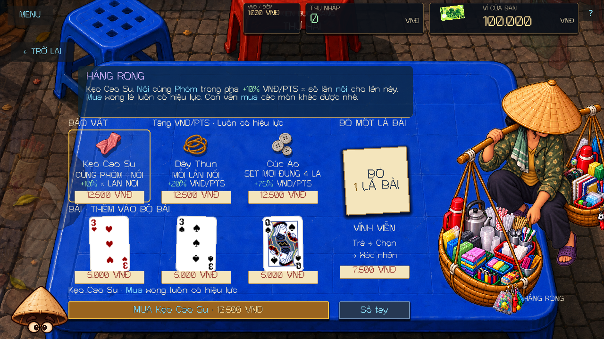
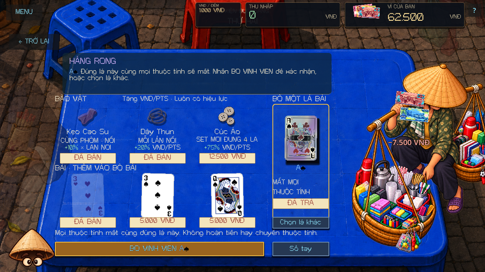
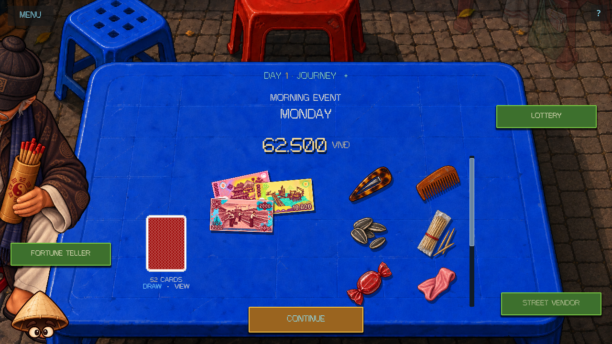
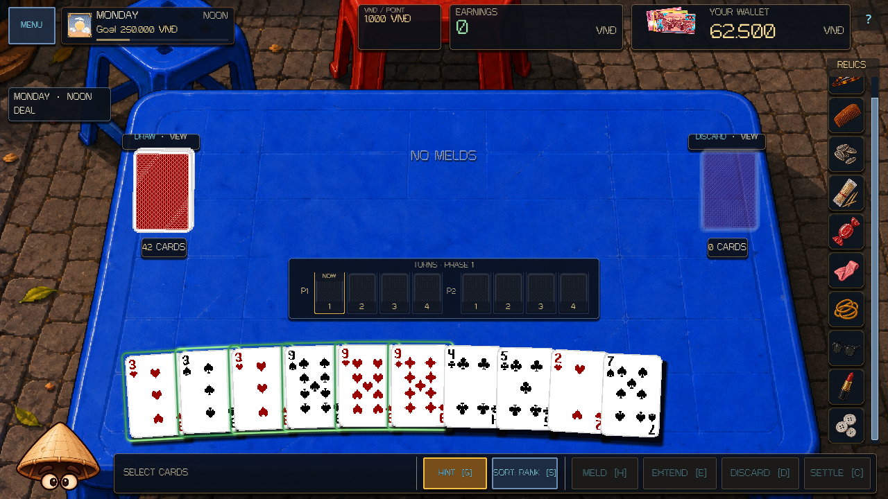

# Hàng Rong deckbuilding shop - 2026-10-06

Hàng Rong now sells relics individually, sells real ordinary cards, and offers paid permanent card removal. The shop follows the requested deckbuilder structure while keeping loose objects on the existing table: select an object, hear Auntie's explanation, then press its named purchase button to confirm.

Every owned relic is active. The former four-relic limit and manual equipment management are gone. During deals, all owned relics appear as inspectable icons in a scrollable vertical rail at the right edge. During events, those same relics remain physical objects on the table, with a scrollable two-column tray as the collection grows. Existing activation outlines, scoring shakes and committed VND receipts remain supported.

## Table presentation

Relics show their localized names, triggers, VND/point bonuses and paper price tags. Ordinary card stock shows its actual rank and suit, with a separate price. Removal has its own paper service slip and price. Auntie's baskets leave the full shop area clear. English and Vietnamese share this arrangement at 1280x720 and 1920x1080.

Selection stays fixed when another object is hovered or focused. Reclicking the same selection preserves the explanation's reveal state. Auntie explains the complete catalog effect; the confirmation identifies the exact selected object and cost. Insufficient funds display the exact shortfall. Purchased objects receive individual SOLD tags while the other stock stays available.

Removal is PAY → choose one owned physical card → confirm permanent removal. The shared deck picker allows transformed and sealed cards. The table then shows the chosen card, its properties, a PAID tag and a final permanent-removal action. All properties disappear with that exact card. The payment and selection survive closing the shop, saving and quitting; the event cannot be left until the paid service is completed. Changing a card's permanent properties invalidates its old confirmation and requires selection again without another payment.

## Gameplay and persistence

- Each visit has three seeded relic slots and three concrete ordinary-card offers. A purchase consumes only its selected offer. Reopening or restoring the same visit retains the exact stock and sold state.
- Card stock uses a separate deterministic RNG. Buying, selecting, reopening, saving and removal do not advance deal shuffle, Gieo, lottery, shoe-polish or Zodiac RNG streams.
- Purchased cards receive distinct run-wide physical IDs and clean ordinary properties. They join the canonical persistent deck and become drawable in later deals. Duplicate ranks and suits remain legal; Sets larger than four use the existing meld authority.
- Removal updates the canonical deck, NPC target pools, inactive deal zones, expected physical IDs, discard records and retained card snapshots. It preserves unrelated cards, properties, paid reading counts and historical scoring receipts.
- Wallet, deck and relic owners commit before observers receive notifications. Reentrant purchase attempts fail safely; successful purchases charge once. Final removal confirmation does not charge again.
- Version 3 saves remain compatible. Existing permanent card properties, physical IDs and owned relics are preserved. Previously unequipped owned relics become active. Legacy saved relic offers remain exact; missing card stock is generated once without advancing saved RNG state.
- New runs and isolated Boss Lab fixtures reset temporary shop state. Restoring the real saved run restores its paid ticket and stock.

Prices are centralized in `RelicShop.PRICE_RULES`, use today's debt independently of wallet balance, and round up to 500 VND with a 500 VND minimum.

| Purchase | Default pricing | At 250,000 VND debt |
| --- | --- | --- |
| Relic | 5% of debt | 12,500 VND |
| Ordinary card | 2% of debt | 5,000 VND |
| Permanent removal | 3% of debt × 1.5 per completed run-wide removal | First 7,500 VND; next 11,500 VND |

The only deck-size safeguard is the gameplay minimum of 17 physical cards, derived from the ten-card active hand and normal mandatory discards across two phases. It does not limit the number of relics or purchased cards.

## Review captures

Additional captures include unaffordable and individually sold stock, the shared removal picker, and the 1080p layout.

The connected Godot editor is running an isolated Vietnamese shop preview with run autosave disabled, profile writes suspended and progression providers detached in memory. The live MCP capture was current and the current-run game log contained no errors.

## Validation

Fresh Godot 4.7.1 processes used isolated APPDATA and LOCALAPPDATA profiles.

- Parse and core: passed; 371/371 core tests, including 12 focused shop tests.
- Shop presentation: 396 rendered pointer/layout checks passed, 99 each in English and Vietnamese at 720p and 1080p. These exercise all ten relic explanations, purchases beyond four, multiple purchases in one visit, actual card buying, paid removal, live deck counts, sold-state reopening, table objects, the real event Continue transition and inspection of the tenth rail icon.
- Separate-process save/resume: 6 write and 32 read checks passed. A paid transformed-card selection, sold stock, acquired physical cards, wallet and RNG state survived a process restart; removal completed without charging again.
- Runtime, tutorial, relic scoring presentation and miscellaneous NPC scene smokes: passed.
- Rendered event table: 116 checks passed. Gieo screen: 460 checks passed. Readability: 66 checks passed. Text reveal: 116 checks passed.
- Boss roster: 5,417 checks passed in headless mode; this does not establish rendered boss presentation.
- Scoped tracked whitespace checks: passed.

An earlier English rendered attempt timed out after its captures. Its focused retry and the final four-configuration matrix completed successfully with exit code 0. Rendered captures and synthetic native pointer input establish layout and interaction behavior; physical touchscreen input was not exercised.

Unrelated checkout work was preserved. No staging, commit, push or cleanup was performed.
