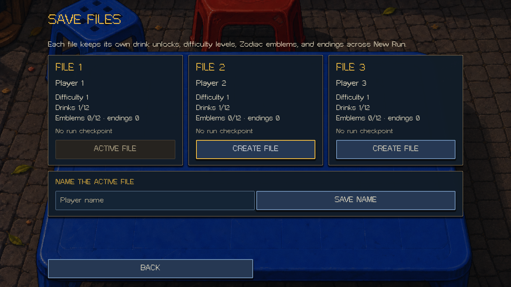
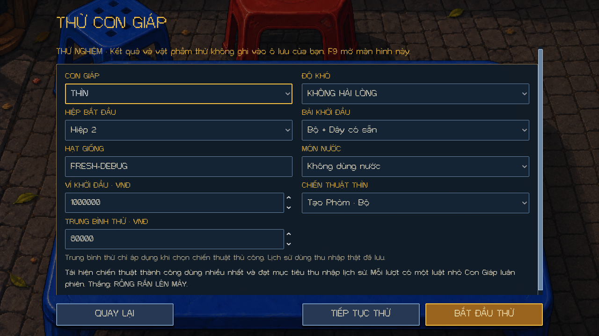
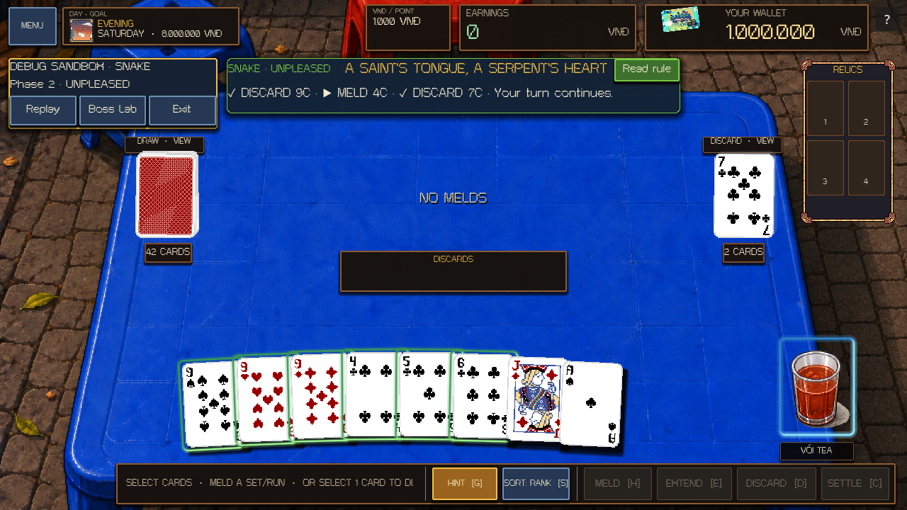

# Save files and Boss Lab — 2026-10-02

The game now has three permanent save profiles and an isolated Boss Lab. Home exposes **SAVE FILES** and **DEBUG BOSSES · F9** in English and Vietnamese.

## Save files

Choose **SAVE FILES** from Home or the Menu. **CREATE FILE** initializes an unused profile; **LOAD FILE** selects an existing one and returns to Home, where **CONTINUE** restores that file's current run. Name the active file with **SAVE NAME**. The last selected file is remembered after restarting the game.

Each file keeps its own Drink achievement counters/unlocks, highest unlocked campaign difficulty, Zodiac relationship/request/boss history, Emblems, special scenes, ending flags, and seen-event IDs. **NEW RUN** replaces only that profile's current run; its permanent unlocks survive. Restoring an older run merges permanent achievements monotonically and uses seen IDs to avoid awarding the same event twice.

Progress saves when its authoritative service commits an achievement. Normal run autosaves continue to record real card zones, wallet transactions, RNG, NPC choices, relics, music transport, and campaign state. Selecting another file first preserves the active run. Language, audio, and tutorial preferences use the existing global Settings.

Existing `demo_drink_progress.cfg`, `difficulty_progress.cfg`, `zodiac_progress_v1.cfg`, and the normal `run_v1.save` import into **File 1** on first use. Original legacy files remain intact. Legacy request history with Godot `StringName` keys is accepted and written as ordinary JSON text keys. Migration runs once per new File 1.



## Testing a boss

1. Press **F9** or choose **DEBUG BOSSES** on Home.
2. Select any of the twelve Zodiac bosses and **PLEASED / NORMAL / UNPLEASED** difficulty.
3. Choose starting Phase 1 or 2, a seed, a known Set + Run or seeded opening, any Drink or no Drink, and the starting wallet.
4. Press **START TEST** and play with the normal controls. Tiger and Snake can immediately change the opening through their real boss actions.
5. Use the visible **Replay / Boss Lab / Exit** toolbar. Replay repeats the selected opening and boss RNG from the same seed. F9 opens the options again, including from phase choices and completed encounters.

Starting Phase creates a fresh fixture directly in that phase. The curated opening contains a Set, a Run, and Extension cards in a real 52-card deck. Boss rules, card movement, scoring, and wallet receipts use the production authorities.

For Dragon, **Analyze my run history** reads completed action reports from the selected profile's saved run. A new profile cannot inherit another profile's history. Choose a manual Meld/Extension tactic to test it with an explicit average; Dragon's target still uses the chosen tier's 80/100/120% scaling. A history with no positive recorded earnings uses the existing disclosed fallback.

**RESUME TEST** restores the last boss checkpoint after a restart, including its phase, physical cards, rule data, RNG, and chosen options. **Exit** returns to the normal profile's Home; **Continue** resumes its preserved run.

Boss tests use detached memory-only progress providers and a separate checkpoint. Test victories, Drink counters, Emblems, endings, and difficulty unlocks never award permanent progress. Tutorial helper progression is disabled in the sandbox. Save-file selection is disabled until exiting the test. The normal Continue route rejects debug checkpoints.

Debug tools appear in full editor/debug builds. For an exported release, explicitly opt in with `-- --debug-bosses`. Demo builds keep their own profiles and omit Boss Lab. Exporting a new executable is a separate build operation; this change is validated in the project.





## Files and recovery

| Purpose | Godot path |
|---|---|
| Permanent File 1 | `user://save_files/full/file_1.meta.save` |
| Current File 1 run | `user://save_files/full/file_1.run.save` |
| Other profiles | Replace `1` with `2` or `3` |
| Active profile selection | `user://save_files/full/active.cfg` |
| Demo profiles | `user://save_files/demo/` |
| Boss checkpoint | `user://debug_boss_run_v1.save` |

Permanent saves use an object-free, checksummed JSON envelope, version 1. Tagged decimal integers retain exact 64-bit values. Staging uses `.tmp`, with a previous-file `.bak` and a 16 MiB complete-file bound. Corrupt primary files recover from a valid backup; the first recovery write preserves that good backup. Oversized or failed writes preserve prior saves. Both unrecoverable copies are kept and the UI lets the player select another file. File identity is checked against its actual slot, including in the file browser.

Run checkpoints retain **RunSave version 2** and existing version 1 compatibility. `debug_context` is additive; an older normal run defaults to an empty context. The existing run codec, object whitelist, checksum, backup handling, and 64 MiB load limit remain in force.

On this machine the full profile directory is:

`C:/Users/Zerato/AppData/Roaming/Godot/app_userdata/TRADATALA - TRÀ ĐÁ TÁ LẢ/save_files/full`

## Validation

- Core: **305 passed, 0 failed, 0 skipped**. Added profile/migration/recovery/bounds tests and deterministic boss fixtures for all **12 × 3 × 2** boss/tier/phase combinations.
- Rendered production UI: **221 checks, 0 failures**; independent fresh-process resume: **12 checks, 0 failures**. Covers actual menu buttons, all 36 boss/tier starts, bilingual toolbar fit, 52-card accounting, sandbox isolation, tutorial isolation, profile selection/rename, and selected-profile Dragon history.
- Existing Zodiac roster rendered smoke: **746 checks, 0 failures**.
- Existing Demo smoke: **264 checks, 0 failures**.
- `tools/validate_project.ps1 -Strawy`: **26 stages passed**, including normal campaign/progression/music write/read pairs, runtime, tutorial, front end, Event Table, Drinks, Zodiac, and Strawy smokes. Final save-key/identity refinements were subsequently rechecked with the core and rendered write/read tests.
- Connected editor: synthetic F9 and pointer Start/Replay/Exit succeeded for Snake, UNPLEASED, Phase 2. Gameplay unlocked and 52-card accounting passed. Normal run and permanent-file hashes stayed unchanged during replay and exit. File 1 imported the existing `42E9DF65` run with identical bytes and retained the Cat Emblem and its 14 resolved requests. The migrated permanent file reopened successfully. That verified session had no fresh game errors or editor errors after cursor 297. The later Snake error and its fix are recorded below.
- Subsequent live testing exposed a Snake extension-command typed-array error when a Meld already existed. Single-card additions are now explicitly typed for legality and scoring previews; a regression covers NORMAL/UNPLEASED in both phases, including the next real discard/refill turn. The core suite and production UI write/read coverage were rerun after the fix.
- `git diff --check` passed. Existing mixed work remains uncommitted.

Automated input and rendered checks do not constitute physical touchscreen testing, a full manual campaign playthrough, or an exported-build check.

The canonical validator now includes the new meta/debug write/read pair. Reproduce it with:

```powershell
& tools/validate_project.ps1 -Godot 'C:\Users\Zerato\Downloads\Godot_v4.7.1-stable_win64.exe\Godot_v4.7.1-stable_win64_console.exe' -Strawy
```

Detailed completion markers and connected-editor evidence are recorded in [META_SAVE_BOSS_DEBUG_VALIDATION_2026-10-02.json](META_SAVE_BOSS_DEBUG_VALIDATION_2026-10-02.json). Local raw logs and isolated test profiles are under `.godot/meta-debug-validation/` and `.godot/validation/`.
