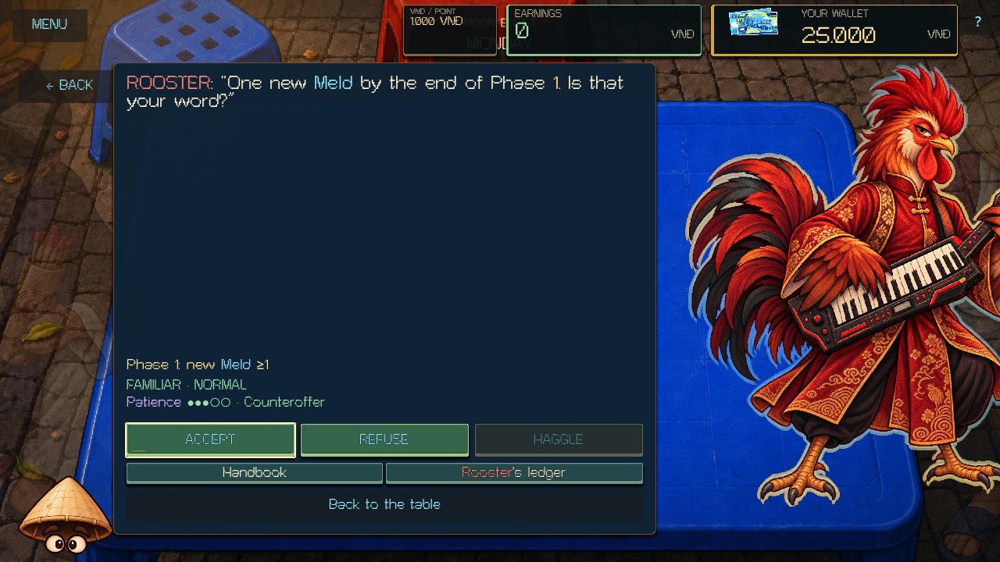
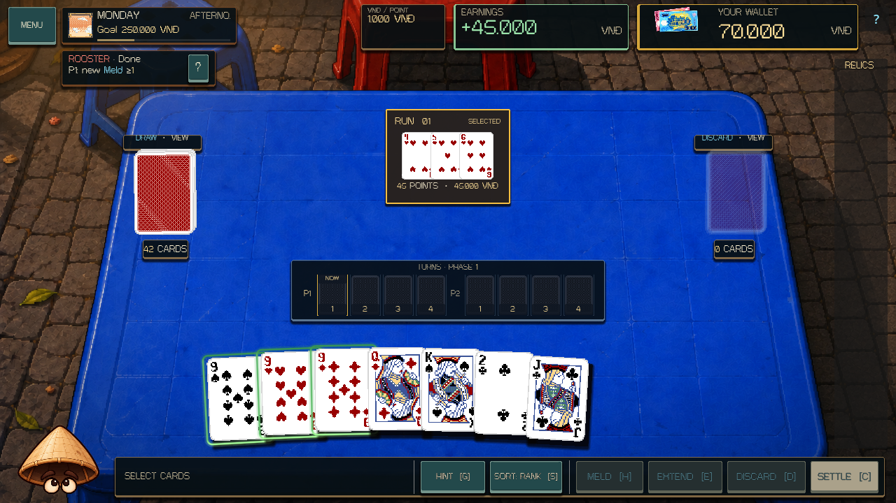
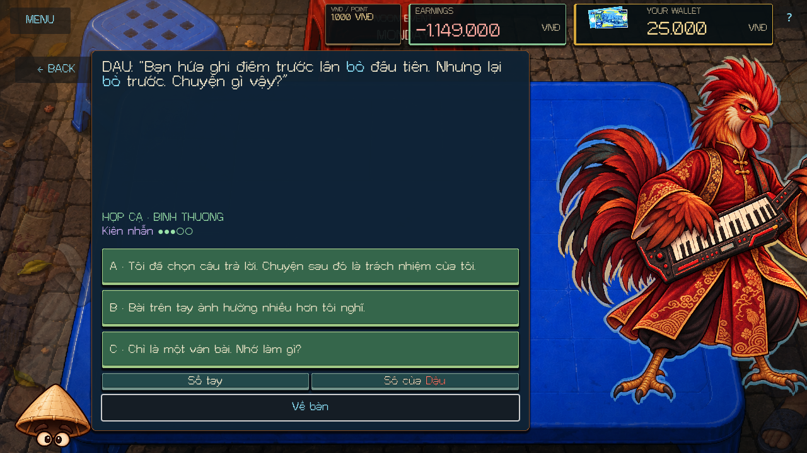
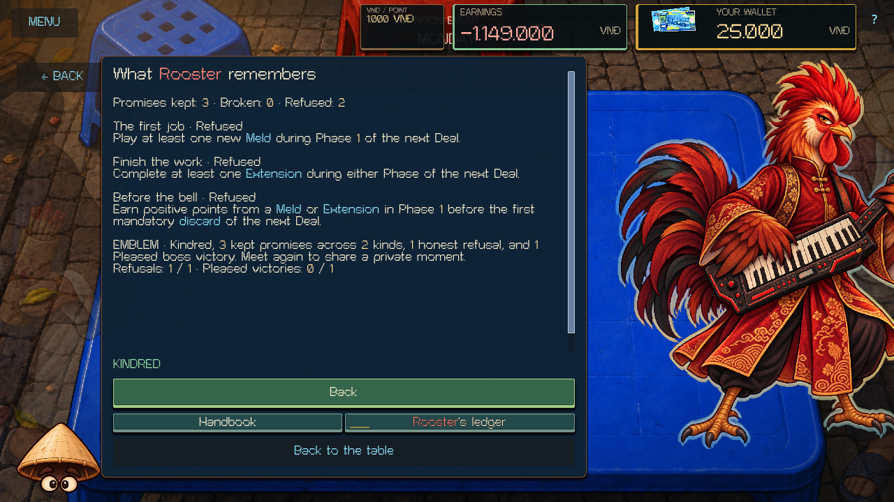

# Rooster: time, a usable answer, and finished work

Fresh Rooster visits now use authored persuasion from Stranger through Kindred. His voice centers on punctuality, clear boundaries, and follow-through: an honest refusal is useful; a convenient yes that becomes somebody else's problem is not. Cat's dialogue and promises remain their own content.

## Encounters

Twelve bilingual nodes live in scripts/zodiac/content/rooster_persuasion.gd:

| Relationship | Content | Visit |
| --- | --- | --- |
| Stranger | Waiting, saying no, finishing work | Three questions in seeded order |
| Familiar | Before the bell, the first job, finishing an Extension | One question followed by a concrete optional commitment |
| Kindred | Three remembered outcomes, the watch turned down, room at the table, staying after work | One eligible encounter; all three commitments remain available |

The permanent relationship advances to Familiar after a Pleased Afternoon judgment. Kindred requires three kept commitments across at least two kinds, followed by a Normal or Pleased return. Repeating one commitment cannot substitute for variety. The current visit starts with three Patience; choices and actual promise outcomes change it within zero to five. A first zero opens an authored Last Chance. A plain answer or an honest inability to commit can recover to one; a second zero ends the visit.

The seeded content plan, current dialogue, pending response, Patience, counteroffer, action evidence, and random state belong to the campaign save. Reopening or resuming does not choose another conversation.

## Commitments

| Commitment | Fulfillment | Counteroffer |
| --- | --- | --- |
| Before the bell | Positive scoring points from a Meld or Extension in Phase 1, before the first mandatory discard of the next Deal | At least one new Meld during Phase 1 |
| The first job | At least one new Meld during Phase 1 of the next Deal | At least one Extension in either Phase |
| Finish the work | At least one Extension in either Phase of the next Deal | At least one new Meld during Phase 1 |

Acceptance reserves an obligation; it does not complete it. Refusal and haggling cost no money, cards, Relics, or Patience. A counteroffer replaces the shown terms and requires explicit acceptance. It can be offered once. Refusing it remembers the alternate commitment that was actually refused.

Only successful committed DealState actions count. Previews, failed attempts, other Deals, and restoration do not provide fulfillment evidence. Zero-point plays do not fulfill an early-score promise. The first mandatory discard closes that deadline; Trà Đá's optional discard does not. Phase 2 cannot rescue a Phase 1 commitment. The service waits for the Afternoon Deal to finish and judges on the same-day Afternoon return.

The compact table reminder shows the action, deadline, and Pending / Done / Missed state. The Handbook retains the exact full contract. Gameplay legality and scoring remain in their existing authorities.

## Memory and Emblem

Rooster's ledger shows kept, broken, and refused commitments, progress toward Kindred, and the latest result for each commitment kind. Memories store the exact bilingual terms, including the alternate terms if accepted or refused. Recall encounters require a real result for that topic; the active encounter freezes the recalled event so a profile update cannot rewrite a conversation already shown.

Permanent history survives a new run and belongs to the active Save File. Loading an older run checkpoint merges history without replacing a newer remembered result.

The existing brass Rooster private scene and Emblem remain available. The new story route requires Kindred, three kept commitments across two kinds, one honest refusal, and one Pleased evening boss victory. Meeting Rooster again unlocks the scene. His ledger then exposes the existing future appearance preference. Previously earned scene eligibility and owned Emblems remain valid.

## Compatibility and scope

The Zodiac service snapshot is version 4; the run and permanent save envelopes keep their existing versions. An already-started Rooster demand chain, paid request, counteroffer, or legacy promise from version 3 or earlier finishes under its saved rules and costs. A save from before that negotiation starts can enter the new content. A later day uses fresh authored visits.

Rooster's evening register timing, legality, scoring suppression, artwork, and animations are unchanged. This pass extends his daytime system. It does not add a second scoring or campaign authority.

## Validation

The focused core suite covers mandatory versus optional discards, zero scoring, Phase boundaries, real Extensions, absent actions, delayed judgment, duplicate confirmation, counteroffer refusal, Last Chance, remembered outcomes, old saves, and both Emblem routes.

rooster_persuasion_scene_smoke.gd uses the actual MatchUI, pointer and keyboard input, Handbook, action reminder, Meld control, completed Afternoon Deal, ledger, and private scene. It renders all authored questions and all three outcome branches of every recall node in English and Vietnamese at 1280×720 and 1920×1080.

rooster_persuasion_resume_smoke.gd writes and restores ten states in separate Godot processes, then verifies permanent history and Save File isolation independently of the run checkpoint.

All 431 core tests pass, including 18 new Rooster cases. The rendered Rooster pass completes 809 checks with zero failures and 111 captures. Fresh-process saves pass 17 write checks and 47 read checks across ten saved states, plus independent permanent-profile and Save File isolation checks.

The regression pass also passes the main MatchUI runtime, legacy Zodiac scene (106 checks), evening boss presentation (647 rendered checks), original Cat presentation (333 rendered checks), Cat's Kindred expansion (557 rendered checks), and both Cat and legacy negotiation fresh-process save pairs. All 14 registered checks complete without engine errors. Hashes preserve 201 pre-existing dirty or untracked files outside this authored scope; the original Cat authority text and both evening rule scripts remain intact.

[Full validation record](ROOSTER_EXPANSION_VALIDATION_2026-10-10.json)

These results describe the working-tree implementation pass. [Checkpoint validation](CAT_ROOSTER_CHECKPOINT_2026-10-11.md) checks the isolated Cat/Rooster delivery independently of unrelated local changes.

### Representative rendered evidence

The action screenshots follow an actual GUI Meld and completed Afternoon Deal. The callback and ledger screenshots use controlled history fixtures to exercise the authored branches.

