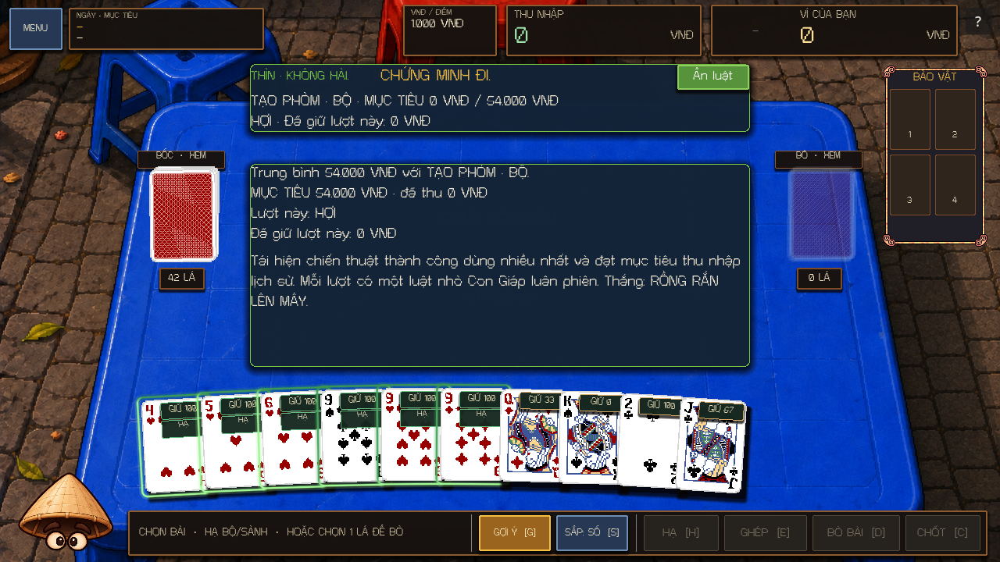
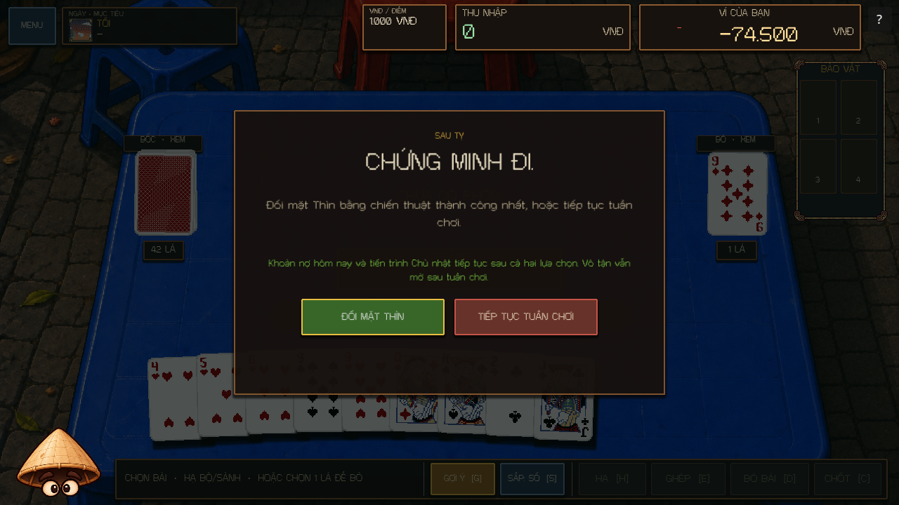

# Zodiac runtime implementation — 2026-10-02

All twelve Zodiac bosses are implemented, including their three difficulty tiers, authoritative runtime state, save/restore, bilingual presentation, and post-Snake Dragon encounter. The difficulty addendum overrides the master plan wherever they differ: there is one `PLEASED=1 / NORMAL=2 / UNPLEASED=3` axis, and Snake sabotage keeps the player's turn alive.

The current daytime flow and artwork supersede the original fixed requests and placeholder medallions: see [Noon/Afternoon negotiation](ZODIAC_NEGOTIATION_2026-10-02.md). This report's evening mechanics remain applicable.

## Architecture

`ZodiacBossRule` dispatches to twelve small rule modules through `ZodiacMechanic` hooks for phases, turns, legality, payouts, committed actions, income, deadwood, mandatory discard selection, and settlement. Each encounter retains a separate seeded RNG and primitive snapshot data. Payout previews and the hand advisor query rules without advancing RNG or counters.

`DealState` owns actual card movement and scoring; `VndWallet` owns committed money. Boss changes use journaled transactions and action/result dictionaries. Mouse-owned Melds and temporary loans are explicit physical zones included in accounting, restore, and exhaustion recycling. Mouse uses real `MeldRules` and `ScoringPipeline`; its actions do not invoke the player's relic or payout engines. Loan-return shuffling accepts an explicit boss-derived seed and uses a local RNG, leaving the deck RNG untouched.

Dragon reads retained campaign action telemetry, selects the most frequently successful `action:meld_type` tactic, and derives its target from actual earned VNĐ. Ties use total earnings, then a stable tactic key. It activates one curated miniature modifier per turn through separate `dragon_*` hooks. The old modifier expires before refill, and Dragon does not activate a second full boss runtime.

## Mechanics

| Zodiac | Implemented behavior |
|---|---|
| Rooster | Phase 1 register closes after 3/2/1 mandatory discards. Closed scoring actions still move cards and pay zero. UNPLEASED Phase 2 allows Extensions only. Extra Drink discards do not advance the deadline. |
| Cat | Phase 2 locks 1/2/3 actual cards after refill; locked cards still count as deadwood. At least one ordinary discard remains available. UNPLEASED Phase 1 allows new Melds only. |
| Dog | First new Meld each Phase is LOYAL and pays fully. Other Melds pay 50/0/0 percent. UNPLEASED blocks further new Melds while retaining LOYAL Extensions and cycling. |
| Monkey | PLEASED permits two consecutive paid actions of the same type; the third pays zero. NORMAL prevents immediately repeating the last paid type. UNPLEASED shows a seeded three-action sequence. Misses remain legal and neither end the turn nor advance the sequence. |
| Pig | Siphons 20/30/40 percent of positive qualifying earnings, tracks the visible gross earnings target, and returns the entire pool upon success. UNPLEASED applies its configurable failed-target bank penalty once. |
| Ox | Tracks each carried loose card separately and doubles its deadwood burden per completed turn. PLEASED grants one completed-turn grace per card; UNPLEASED applies the configured Near-Meld add and multiply treatment. Removing and later recovering a card starts a fresh burden. |
| Horse | Requires two matching Meld or Extension actions per turn. An incomplete pair replaces the requested mandatory discard with one random legal actual card. PLEASED has one grace per Phase; UNPLEASED has two turns per Phase. |
| Goat | First paid action anchors an ascending consecutive Rank rhythm, wrapping K to A. Only newly committed ranks count. PLEASED has one mistake grace per Phase; UNPLEASED also requires turn parity. Rhythm misses remain legal and pay zero. |
| Mouse | Borrows up to 2/3/4 available stock cards after a discard, chooses a real hostile Meld or Extension, and deducts its actual payout. New hostile Melds occupy its own zone. Unused loans return and reshuffle; UNPLEASED can reuse eligible previous-Phase discards. |
| Tiger | Immediately snatches one highest-Rank card / all highest-Rank copies / all copies of the most strategically valuable Rank. Hard targeting prioritizes Near-Meld participation, Meld potential, Extension potential, then rank/value. UNPLEASED suppresses only the exhaustion bonus; recycling remains valid. No prey warning is added. An empty hand can end its turn without a fake discard. |
| Snake | Issues up to 1/2/3 valid commands. Immediate forced discards and targeted sabotage move real cards and preserve the current turn and mandatory-discard count. Targeted Drink commands identify exact recoverable cards and targets. |
| Dragon | Restricts paid scoring to the historical tactic, uses a target of 80/100/120 percent of its actual historical average, and rotates one difficulty-matched curated modifier each turn. Successful settlement records the first ending, **RỒNG RẮN LÊN MÂY**, idempotently. |

Schedule: Monday Rooster/Cat, Tuesday Dog/Monkey, Wednesday Pig/Ox, Thursday Horse/Goat, Friday Mouse/Tiger, Saturday Snake alone. Completing Snake presents **Face Dragon** or **Continue the week**. Either branch retains daily debt and Sunday progression; Sunday has ordinary deals without a Zodiac. Weekly completion and Endless remain available.

## Provisional tuning and explicit assumptions

All numeric boss tuning lives in `ZodiacCatalog.TUNING`.

- Pig's baseline target is **50,000 VNĐ**, scaled to **40,000 / 50,000 / 60,000**. Its failed-target penalty is `floor(max(bank, 0) × 50%)`, charged once at final settlement. This formula never adds a penalty to an already negative bank.
- Ox's normal burden is `value × 2^(completed_turn_age − grace)`, with a minimum exponent of zero. Its provisional UNPLEASED Near-Meld formula is **`(value + 5) × burden_growth × 2`**.
- Goat's unspecified initial note is chosen by the first qualifying paid action; ranks then ascend and wrap K to A. A multi-card action must follow the exact consecutive ranks of the newly committed cards.
- Legacy history without positive actual payout cannot supply an invented average. Dragon explicitly falls back to `new_meld:set`, reports average zero, and uses a **50,000 VNĐ** fallback basis scaled by difficulty.
- Dragon mini Ox uses multipliers **2/2/4** rather than retaining the full encounter's growing burden. Mini Goat selects a note compatible with Dragon's required tactic; hard parity is applied when a compatible legal note exists. The mini systems deliberately omit full encounter phase restrictions and accumulated obligations.
- Daytime demand profiles are currently authored for Rooster and Cat. Other visitors remain inert at Noon/Afternoon and default to NORMAL evening difficulty; their existing evening rules and provisional unlock prerequisites are retained. New favorite-gift identities are empty pending character content.

## Save format

The envelope remains **RunSave version 2**, with existing version 1 compatibility. Changes are additive: boss difficulty, RNG state, rule data, Mouse Meld/loan zones, expanded action telemetry, and Zodiac endgame choice/analysis/progress. Missing fields restore to safe defaults; legacy `NEUTRAL` migrates to `NORMAL`; `mouse` aliases the existing `rat` identifier. Two new campaign phases are appended, preserving prior enum values. A resumed older Sunday can retain its already selected boss, while new Sundays follow the new schedule.

## Changed files

This lists the Zodiac work, including scoped changes in files that already contained unrelated work in progress.

- New runtime: `scripts/zodiac/zodiac_mechanic.gd`, `zodiac_tactics.gd`, `dragon_analysis.gd`, and `scripts/zodiac/rules/{rooster,cat,dog,monkey,pig,ox,horse,goat,rat,tiger,snake,dragon}.gd`.
- Existing authorities: `scripts/zodiac/{zodiac_boss_rule,zodiac_catalog,zodiac_service}.gd`; `scripts/gameplay/{deal_state,discard_record,hand_advice}.gd`; `scripts/deck/deck_manager.gd`; `scripts/melds/meld_rules.gd`; `scripts/scoring/scoring_context.gd`; `scripts/campaign/{campaign_manager,run_save}.gd`.
- Presentation/integration: new `scripts/ui/zodiac_boss_hud.gd`; scoped changes to `scripts/ui/{match_ui,event_table_controller,zodiac_table,front_end,resolve_receipt}.gd` and `scripts/audio/gameplay_music_conductor.gd`. Dragon has a distinct deal seed and uses the existing evening music routing, including resume checkpoints.
- Assets: the supplied `assets/zodiacboss/*.png` characters and daytime overlays replace all eight placeholder SVG medallions and their import sidecars. The persistent `rat` ID uses `mouse.png` / `mouse_overlay.png`. Dragon's endgame uses `dragon.png`.
- Tests/tools: expanded `tests/test_zodiac.gd`; new `test_zodiac_runtime.gd`, `test_zodiac_endgame.gd`, and `zodiac_full_roster_smoke.gd`; main runner includes all seventeen suites. `tools/validate_project.ps1` includes the roster smoke. `tests/drink_quick_smoke.gd` now explicitly enables the existing test-only free/unlocked override instead of assuming production drinks are free.
- Documentation: this report and `docs/ZODIAC_VALIDATION_2026-10-02.json`.

Unrelated pre-existing WIP was preserved. No staging, commit, push, export, or publication was performed.

## Validation

**All checks completed successfully.** Godot **4.7.1** fresh processes used isolated `APPDATA` and `LOCALAPPDATA`, including shared isolated profiles only for the intentional write/read resume pairs.

| Validation | Result |
|---|---|
| Final combined headless core, all 17 suites | **287 passed, 0 failed, 0 skipped** |
| Final GPU-rendered full Zodiac roster | **746 checks, 0 failures** |
| Every repository smoke script in `tests/` and `tools/` | **40 distinct scripts passed** |
| Canonical validator with `-Full -Strawy` | **PASS**, including runtime, tutorial, campaign/demo, progression/resume, resolve, relic, money, music, history, and helper coverage |
| Additional previously omitted smokes | **PASS**, including both rendered card checks, Demo, quick Drink input, material effects, major events, title disc, triggers, and UI layout/refinement |
| Whitespace/conflict check | `git -c core.safecrlf=false diff --check` **PASS** |
| Connected Godot MCP runtime | Dragon fixture loaded, actual rule button opened via injected pointer, 52-card accounting valid, wallet unchanged by presentation; no current-run errors or new editor log entries |

The full validator's core passed at 281 tests before the six previously separate card-material tests were included in the main runner. The final combined core then passed at 287, and the rendered roster was rerun after the last Horse tuning/presentation change. Every smoke script's final completion marker and log path is recorded in the JSON manifest. Earlier failed attempts remain in scratch logs and are not counted as passes.

New tests cover all 36 boss/tier combinations, legacy difficulty migration, action legality versus payout suppression, phase resets, Drink interactions, actual committed wallet receipts, RNG independence, deterministic future behavior after disk restore, physical zones, hostile multi-card Extensions, whole-stock borrowed Melds, exhaustion, Snake obedience/sabotage, Dragon telemetry/targets/modifier expiration, both saved post-Snake choices, ending persistence, Sunday/debt/Endless, and music routing checkpoints.

The roster smoke covers both EN and VI across all difficulties, loaded portraits, read-only HUD updates, Mouse-owned card faces, overlap with actionable controls at 1280×720 and 1920×1080, real rule-button pointer input, committed money queue integration, and both post-Snake buttons.

Logs: `.godot/validation/` and `.godot/zodiac-validation/`. The JSON manifest records individual evidence paths. The MCP preview used nonpersistent test progress and was stopped after inspection.

## Presentation and remaining work

The live bilingual HUD exposes boss state, full rules, commands, progress, feedback, and Mouse-owned cards. A compact panel clears the deck and discard controls; its expanded rule panel is explicitly toggleable. The post-Snake decision and Dragon ending are wired.

Optional presentation work remains: replace the eight SVG medallions with final character portraits; add bespoke character reactions, voice/audio cues, and richer Mouse/Tiger/Snake action animations. Current play remains functional without those animations.

Automated, rendered, save/restore, and MCP runtime evidence does not establish long-run balance, human physical-input usability, new listening quality, or exported-build/platform behavior. Pig/Ox and curated Dragon assumptions require playtesting.

