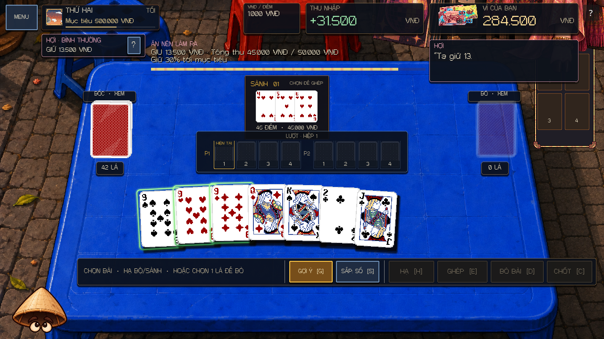
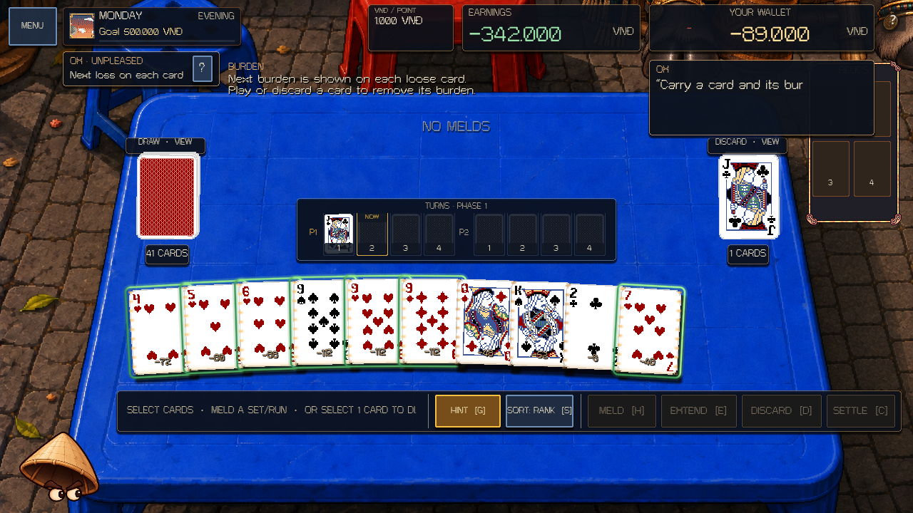
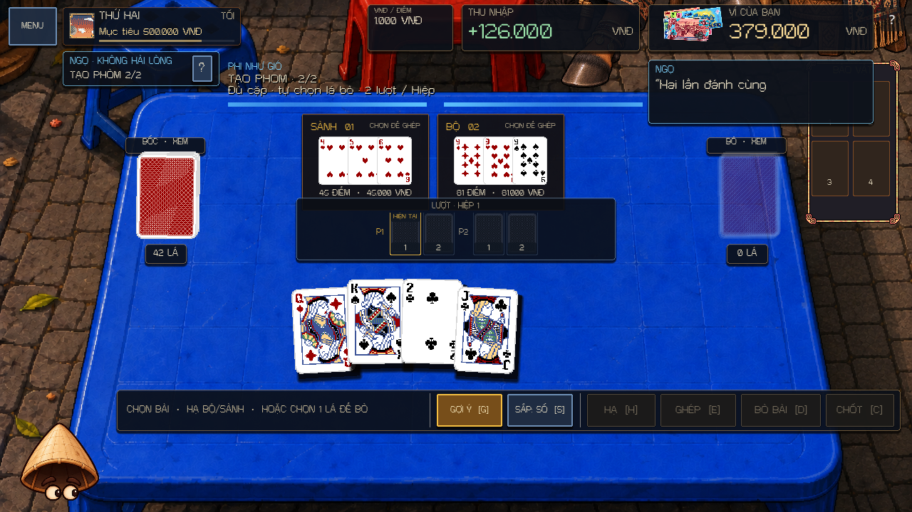
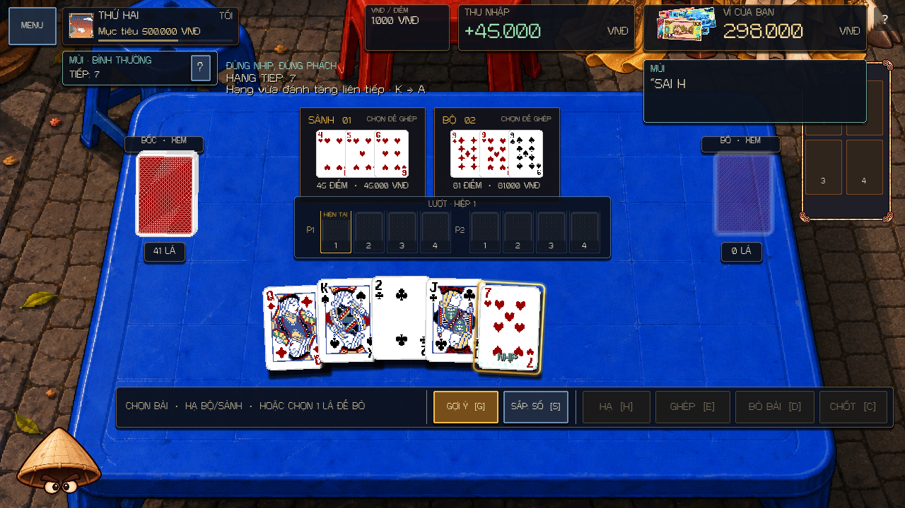
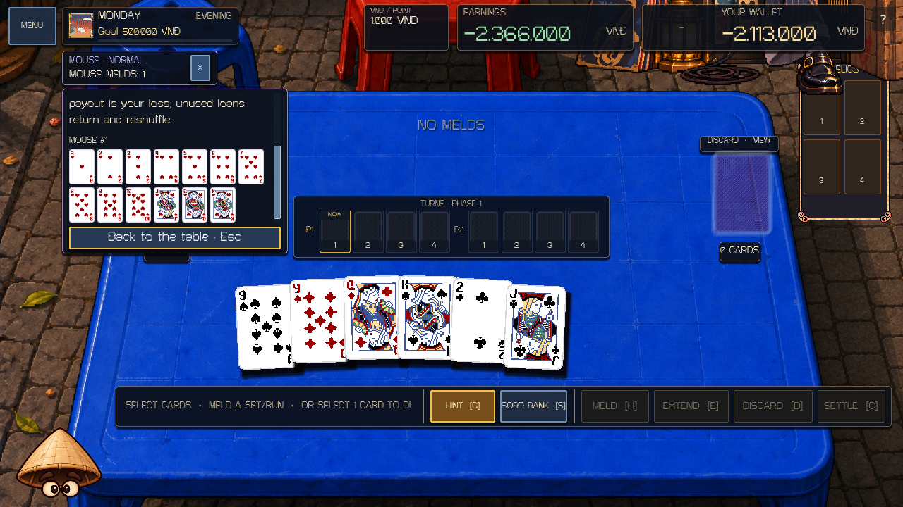
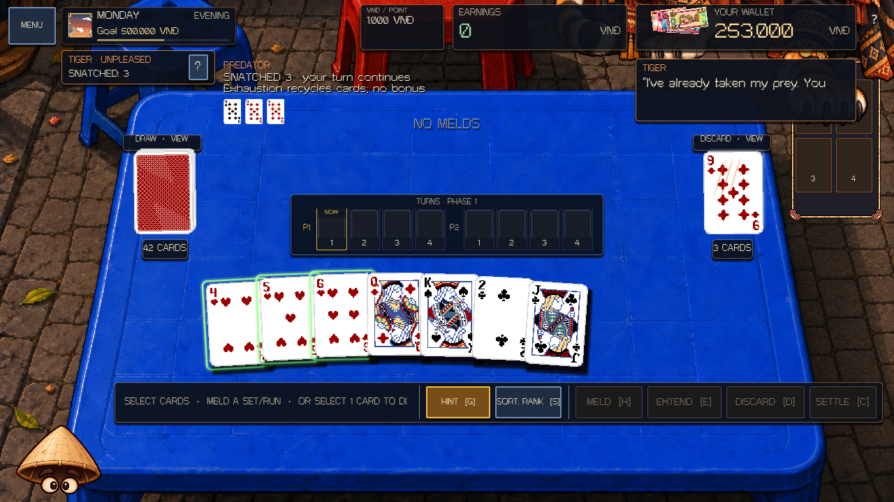
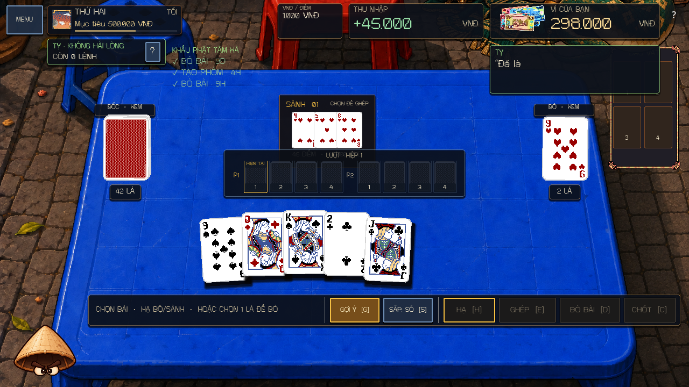
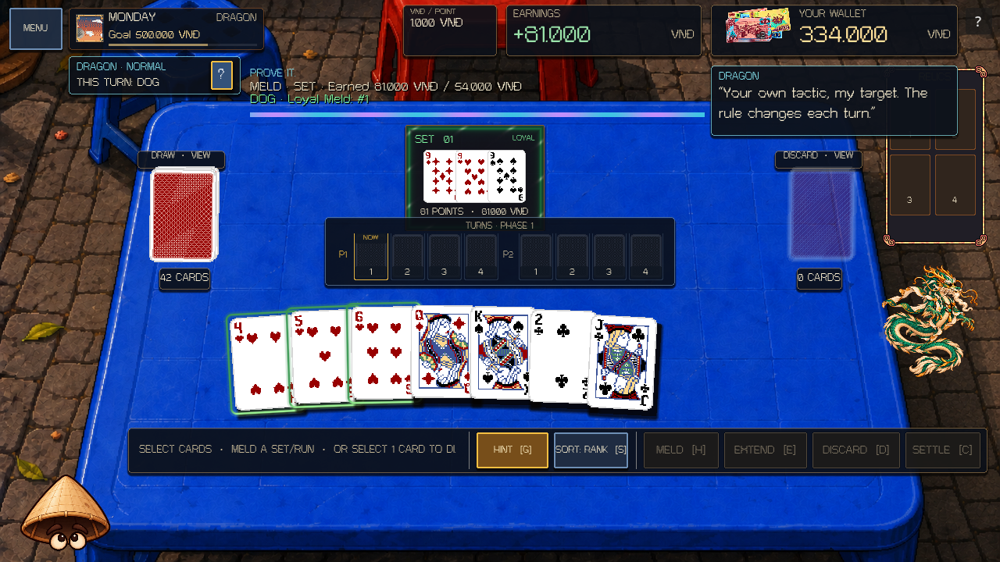
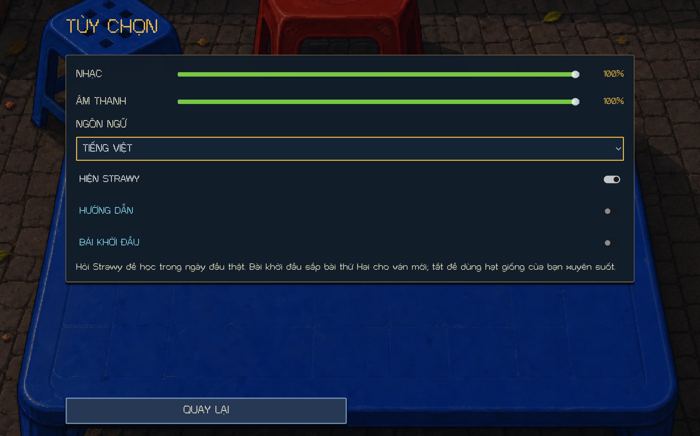
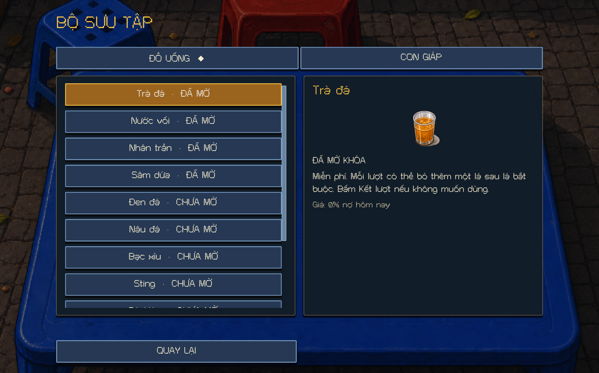

# Zodiac presentation and UI audit — 4 October 2026

All twelve bosses now use the established table, compact top-left badge, supplied art, speech and rule inspection. Their effects identify the affected mechanic. The table retains its existing background, card interaction and gameplay rules.

| Boss | Presentation on the affected mechanic |
| --- | --- |
| Rooster | Red register deadlines on the actual turn slots; closed-register payout warning. |
| Cat | Purple smoke on the physical locked cards; locks follow the current turn. |
| Dog | Green guard on the actual loyal Meld, retained through Extensions. |
| Monkey | Fresh action/count/cap in the badge; text-only Dance Baby sequence above Melds, with animated glyphs and completed-step sparks. |
| Pig | Held pool, gross earnings, target and return state; segmented gold progress stream. |
| Ox | Amber chains and next burden points on each held card, including Near-Meld severity; exact tooltip before the turn penalty multiplier. |
| Horse | Actual matching-action count, remaining grace and mandatory random-discard warning; blue two-part meter and real short-phase turn slots. |
| Goat | Next Rank and hard-mode opening parity; mint note shader on eligible physical cards. A missed play does not advance the note. |
| Mouse | Actual owned Meld count and last deduction; violet stitches on stolen faces. Every stolen Meld is available in the drawer. |
| Tiger | Actual snatched-card previews and orange claw marks on the affected discard face; hard-mode exhaustion warning. |
| Snake | Every command and its fulfilled/violated/pending state above Melds; green coil on the next command's physical cards. Clicking the pending command selects suggested cards; the ordinary action still commits the play. |
| Dragon | Historical tactic, actual earnings/target and current rotating modifier; separate prismatic target meter. Relevant modifier cues reuse the underlying mechanic. Its supplied portrait fits beside the table below the relic rail. |

Presentation remains read-only. DealState and ZodiacBossRule own counters, eligibility, card zones, commands, scoring, RNG and persistence. Repeated refreshes are checked against unchanged rule snapshots. No tuning, save format, progression or Drink scoring behavior changed.

## Problems corrected

- Boss state no longer depends on clipped long text in the small badge. Essential instructions occupy a fitted text lane above Melds, clear of cards, piles, wallet and speech.
- Dragon's portrait was being stretched as a full-table overlay and covered the cards. It now has bounded placement; the header names the Dragon endgame instead of showing a dash.
- Mouse inspection previously exposed only two Melds. The drawer now lists them all, wraps large card faces, supports a full 13-card run, and keeps its focused close button visible outside the scroll area. Escape returns focus to the boss badge.
- Hand cues clear when cards move, bosses change or the table leaves the Deal. Menus, modal dialogs, deck/discard inspection and money presentation clear floating guidance. Monkey's completion animation resumes after the money receipt.
- Enchanted-card tooltips now use the localized `GIEO QUẺ` title instead of `GIEO QU?`. Ox's expanded multiplier display uses the authoritative exponent cap.
- Windows validation retains the process handle before a fast parse exits. Front-end and Drink smoke tests explicitly stop music before teardown, eliminating their shutdown resource errors.

## Verification

Godot 4.7.1: **5,417 roster checks passed** in both headless and native Vulkan/Forward+ runs on Intel Iris Xe. Coverage includes all twelve bosses, all three dispositions, English/Vietnamese, 1280×720, 960×620 and 1920×1080, all eleven curated Dragon modifiers, real card commits, snapshot/RNG stability, pointer selection, drawer focus and scroll reachability. Forty-six rendered boss captures were generated; representative screens for every boss were inspected, with additional live menu/settings/collection evidence.

Supporting checks passed: **335/335 core tests**, **631 Rooster/Cat presentation checks**, **709 Dog/Monkey checks**, **29 boss money-presence checks**, **746 full-roster rule checks**, and the main-scene runtime smoke. All forty smoke invocations plus parse in the validator's Full/Strawy matrix completed successfully across the initial and resumed batches. Additional layout, quick Drink and text-reveal smokes passed.

The live MCP game also verified Snake command pointer selection followed by the ordinary Meld hotkey, Settings pointer navigation and Escape, and scrolling/selecting the final collection item without a wallet change. Current-run game logs and editor logs since the audit cursor contain no new errors. Two retained editor errors predate these runs; current source, fresh processes and main-scene boot were verified separately.

Logs and isolated test profiles are in `.godot/validation/` and `.godot/roster-ui/`. Screens are fixtures and synthetic pointer/keyboard checks; exported builds and physical touch devices were not tested. Existing unrelated dirty source, imports and bus configuration were preserved. Work remains local and uncommitted.

## Rendered evidence

