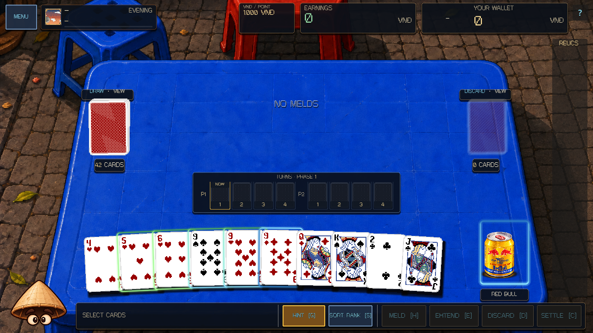
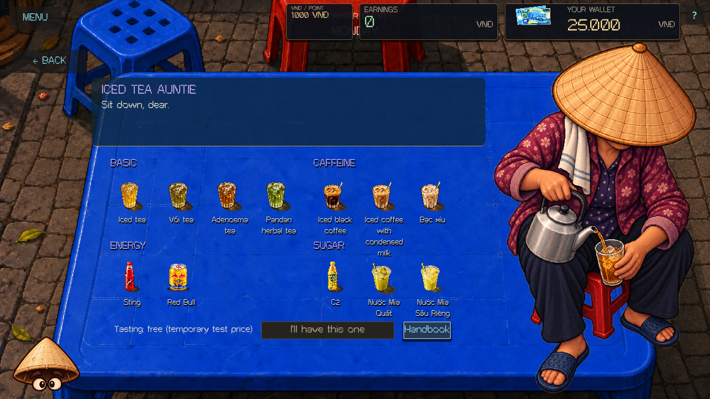

# Drink sprite overhaul — 2026-10-07

All twelve supplied drink sheets now replace the previous table/shop/collection
art, using 36 production full/half/empty sprites. Bò Húc's additional sheet was
cut into two exact crops in `C:\Stuffs\Asset\drink\pieces\energy_redbull`: sealed
and opened. Full uses the sealed can; half and empty share the opened can because
no separate empty-can drawing was supplied. All Drinks use their supplied colors
without category tinting. The cup drag preview inherits the active table sprite.

Production sprites share a 700 × 900 canvas and base contact point (280, 776).
Each drink uses one scale across its three states; Sting's larger original is
scaled with nearest-neighbour sampling, as is Bò Húc. The clickable table slot retains its
112 × 178 footprint, with a 112 × 144 sprite/charge outline and separate
nameplate. The scene anchors the slot to the bottom-right table edge rather than
reassigning absolute coordinates during visual refresh. The follow-up moves its
horizontal offsets from `(-119, -7)` to `(-183, -71)`: every Drink moves 64 logical
pixels left onto the painted table, without changing its baseline or footprint.
Vessel bases remain in
the same place when choosing another drink, changing fill, changing the serving
or campaign period, restoring usage, or resizing the window.

`DrinkPresentation` selects textures from the existing DealState usage flags.
Unused windows show full, spent renewable windows show half, exhausted Deal or
transition usage shows empty, and the final Phase's spent recovery/Pair charge
shows empty. Finished Deals show the corresponding empty vessel. Temporarily
unavailable targets do not imply consumption. No Drink rules, pricing, unlocks,
wallet accounting, or save schema changed.

The [asset notes](../../assets/drinks/README.md), source hash/contact-point
manifest, and `tools/import_drink_sprites.py` describe the deterministic import.
The original sheets and earlier extracted pieces remain untouched.

## Validation

Fresh Godot 4.7.1 processes used isolated test profiles and Dummy audio.

- Fresh editor import and parse passed; the fresh import log has no errors.
- Core: `TRADATALA_TESTS total=392 passed=392 failed=0 skipped=0`.
- Runtime: `TRADATALA_SCENE_SMOKE passed`.
- Original Drink presentation: `DRINK_PRESENTATION_SMOKE checks=584 failures=0`, rendered
  with compatibility graphics. Covers all 36 production states, actual base
  alpha pixels, unchanged visual-refresh gameplay snapshots, consumption and
  usage snapshot restore, shop/collection art, and table geometry at 960 × 620,
  1280 × 720, 1920 × 1080, and 2548 × 1368.
- Rendered Drink shop: `DRINK_SHOP_SMOKE: PASS twelve-drinks inspect-order bilingual targets layouts`.
- Rendered quick gestures: `DRINK_QUICK_SMOKE checks=164 failed=0`.
- Original fresh headless presentation (584 checks) and Drink shop reruns also passed.
- Front-end smoke passed. Final logs for the checks above contain no script or
  engine errors. Scoped whitespace checks passed.
- Rendered table, fill-state, shop, and collection captures were visually
  inspected. Evidence logs and the full capture set are under
  `.godot/drink-overhaul/`.

The Bò Húc/left-placement follow-up adds sealed/opened mapping checks and samples
the original painted background under the vessel's contact point at all four
window sizes. This distinguishes the actual blue tabletop from the transparent
table layout Control and viewport. Fresh follow-up import/parse, runtime, and
rendered quick gesture checks passed (164 checks, zero failures). The updated
rendered presentation run passed `DRINK_PRESENTATION_SMOKE checks=594 failures=0` and is recorded
in `.godot/drink-redbull/`. Updated table/shop previews below show the correction.

The older runtime smoke now compares anchored geometry with floating-point
tolerance. Existing authored dirty work was preserved, including the earlier
participant argument change in MatchUI. Legacy test-generated documentation
screenshots were restored after retaining copies as evidence. Changes remain
local; no export, commit, or push was performed.

